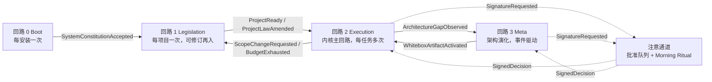
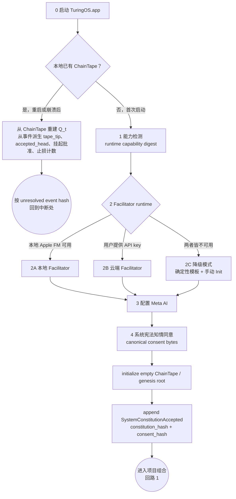
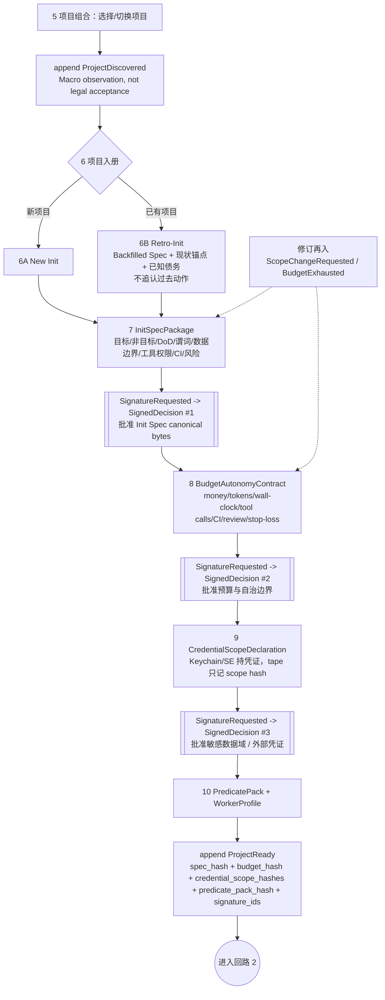
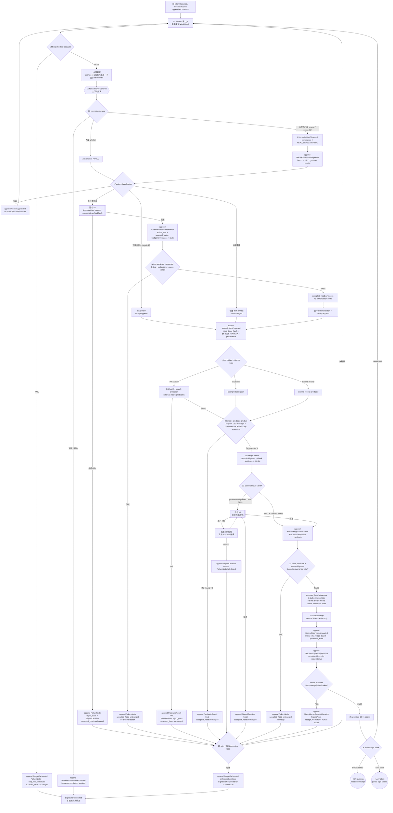
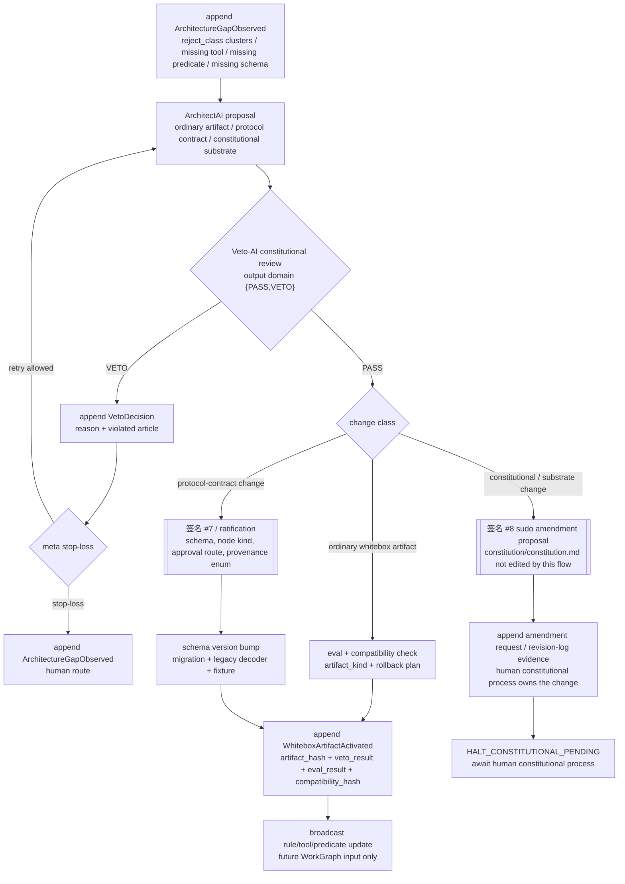
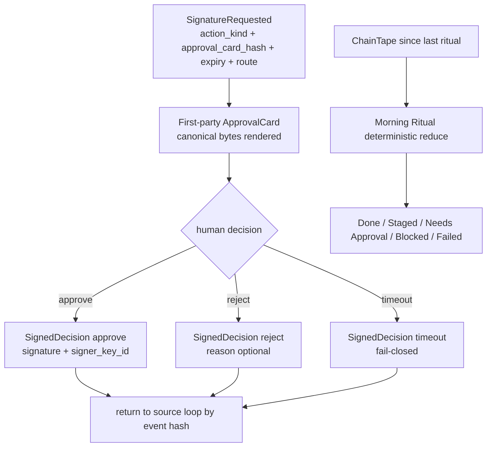

# Turing Agentic OS 白皮书 v0.6

**Two-Scale Sovereign Kernel：让 AI 在你的法律下自治，让每一次自治都可追溯、可验证、可签名、可回放。**

版本 v0.6 · 2026-06-16 · Certification Status: CONSTITUTIONAL PRODUCT CHARTER FOR turingos.app v0.6。本文是 `turingos.app` 产品与架构层的最高宪法级产品宪章，取代 v0.5 作为未来 app 开发的顶层解释文档；但它永远不高于 `constitution/constitution.md`，也不修改 `constitution/constitution.md` 本身。

解释顺序为：

1. `constitution/constitution.md`：整个 TuringOS 系统的 root constitutional law / founding law；除人类 sudo 修宪仪式外不可触碰。
2. `WHITEPAPER.md` v0.6：`turingos.app` 的最高产品与架构宪章。
3. `ADR-019` 与后续 ADR：解释并实现本文的工程裁决。
4. `research/R_v06_directive.md` 与 R-stage memo：执行指令、审计规范与不变量地图。
5. contracts、schemas、gates、product docs、UI copy 与实现代码。

若本文与 `constitution/constitution.md` 冲突，root constitution wins。若 ADR、directive、contract 或实现与本文冲突，下位文档或代码必须修正，除非走显式 ratification / constitutional exception。任何未来开发争议、模糊解释或架构分歧，都必须递归回查 `constitution/constitution.md` 作为 founding law，然后再用本文解释 `turingos.app` 的产品与架构路线。

本文的设计来源包括 `constitution/constitution.md`、已批准的人类 v0.6 directive、R-stage reconstruction memo、ADR-019、`MANIFESTO.md`、`HARNESS.md`、`contracts/README.md`、已落地的 v0.6 审计装置与本文列出的 Phase B gate requirements。任何尚未在仓库中存在、尚未通过 gate 或尚未 ratify 的来源，必须标注为 draft / pending adoption，不得作为已落地事实引用。本文不引入新的外部事实，不声称未实现的运行时能力已经存在。

---

## 0. 一句话

TuringOS 是一个 Apple-native、protocol-native 的个人 Agentic OS。它以宪法为最高真相，以 Micro ChainTape 记录不可抹除的状态迁移，以 Macro Git/GitHub/PR/CI 世界承载用户项目活动，以 Predicate、Veto、Budget、Approval、Replay 和 Projection 把黑盒 Agent 的行动变成受法律约束的、可验证的、可签名的系统演化。

对 `turingos.app` 而言，本文是 constitutional product law；对整个 TuringOS 系统而言，`constitution/constitution.md` 仍是 root founding law。

它不是聊天界面，不是传统项目管理软件，不是 GitHub 客户端，也不是另一个 Agent 平台外壳。它是一个两尺度主权内核：

- **Micro scale**：宪法 ChainTape。一个 Micro tick 是一个 append-only tape node。失败也上 tape。
- **Macro scale**：用户项目世界。Git commits、branches、worktrees、pull requests、CI runs、branch protection snapshots 与 merge commits 是 Macro artifacts。
- **不可混淆原则**：Macro artifacts are not Micro nodes. 它们可以成为观察、投影输入或 MacroAnchor payload evidence，但不能冒充 Micro ChainTape node identity。
- **人的位置**：人类不是监督每行代码的人；人类是立宪、签名、预算授权与主权裁决的根。

---

## 1. 版本沿革

v0.1-v0.4 把 TuringOS 从 macOS agent governance layer 推进到 Apple-native personal Agentic OS，并建立四回路 Operating Flow、签名仪式、风险动作分级与 Software 3.0 UI 哲学。

v0.5 完成定位升级：Apple-native × protocol-native。它补齐 Model Gateway、Capability Registry、Skill Library、外部 Agent Adapter、Live Software 3.0 回路与 Hostile Host 安全模型。

v0.6 的修正不是增加一个功能模块，而是提升系统的法律精度：TuringOS 必须同时承认 Micro 宪法状态机与 Macro 用户项目世界，并强制二者通过显式 anchor、projection 与 approval 连接，禁止在 app、daemon、UI 或 Git 对象之间偷换主权真相。

v0.6 因此把白皮书从产品定位文档升级为受宪法约束的宪法级设计文档。每个产品承诺必须回答四个问题：

1. 它属于 Micro、Macro，还是 Shell projection？
2. 它能否从 tape 或声明的 source 重新推导？
3. 它的判断是 Predicate、Veto，还是 RiskFinding？
4. 用户看到的是证据，还是黑箱按钮？

---

## 2. 最高法律：反奥利奥架构

TuringOS 的架构底座是反奥利奥：顶层白盒、底层白盒、中层黑盒。

中层黑盒是 Agent 个体。它们有创造力，有吞吐量，也会产生幻觉。系统不要求黑盒变成白盒，也不要求人类逐步审阅黑盒推理过程。

顶层白盒只做三件事：

- **量化**：把模糊输出压缩成 Predicate、Veto、Budget、Provenance、RiskFinding 等低维信号。
- **广播**：把可行动、可追踪、可验证的信号传回 agent 生态，而不是广播噪声。
- **屏蔽**：隔离无关上下文、隐藏可被 Goodhart 的评分细节、切断错误模式传播。

底层白盒是工具、契约、hook、validator、shipgate、runtime facade、signature receipt、schema 与 replay path。它们不是“辅助实现”；它们是纪律本体。

系统的核心判断是：黑盒可以生成候选世界，白盒只能量化、接受、拒绝、广播、屏蔽、签名授权和重放。

---

## 3. Art. 0：Turing Machine 原教旨

宪法 Art. 0 规定 TuringOS 必须是真正的通用机器，而不是“受图灵启发”的应用。v0.6 产品层必须按以下映射行动：

| Turing 要素 | TuringOS v0.6 对应 | 产品约束 |
|---|---|---|
| Paper | `tape_t` / ChainTape / reconstructible state | 所有 Micro 信号必须可从 tape 重建 |
| Pencil | append/write interface | 只有声明接口可写；写入必须留证 |
| Rubber | append-only discipline | 失败不删除，拒绝不沉默，修正是新节点 |
| Strict discipline | Predicate + Veto + Constitution | 自然语言不是门禁，门禁必须机械化 |

Art. 0.2 的 Tape Canonical 公理是本文第一物理约束：所有影响系统状态的 Micro 信号必须能从 tape 重建。不能重建的状态只能是缓存、投影或外部观察，不能成为 ground truth。

Art. 0.4 的 `Q_t = <q_t, HEAD_t, tape_t>` 仍是最高架构目标。本文不声称当前 app 已经完整实现 runtime 的 git-style substrate；本文要求所有 app-side 设计不得阻碍该方向，也不得把 app projection 伪装成 runtime truth。任何未来 tape、schema、bus、`wtool` 或 `rtool` 变更都必须声明 Art. 0.4 Path A/B/C；Phase E gate forces Path B unless a human sudo constitutional amendment explicitly lowers the fidelity requirement.

---

## 4. v0.6 两尺度模型

v0.6 的核心设计是 Two-Scale Sovereign Kernel。

### 4.1 Micro scale

Micro scale 是宪法 ChainTape。它承载系统主权状态、签名、预算、谓词、拒绝、失败、approval envelope、failure node、accepted/rejected decision 与 replay 所需材料。

Micro tick 的定义是：一次 append-only ChainTape node。`tape_tip` 指向最新 append 的 Micro node，不论该节点通过还是失败。`accepted_head` 指向最新被 Micro predicate path 接受的节点。`accepted_head_t` 是 root Art. 0.4 `HEAD_t` 的 Micro-scale 产品别名：`accepted_head_t == HEAD_t^micro`。失败节点推进 `tape_tip`，不推进 `accepted_head`。

### 4.2 Macro scale

Macro scale 是用户项目世界。它包括 Git repository、worktree、branch、commit、pull request、CI run、merge commit、branch protection snapshot、GitHub compare 观察与 Galaxy projection。

Macro artifacts 可以被观察，可以被折叠进 projection，可以通过 MacroAnchor 绑定到后续 Micro 决策，也可以作为 observed evidence 出现在 Micro event payload 中；但它们不是 Micro node。Git commit hash 不是 ChainTape node hash；PR number 不是 approval envelope；CI green 不是 sovereign pass。

### 4.3 Shell projection

Shell projection 是 app、daemon、UI、cache、snapshot、dashboard、Galaxy、View IR、menubar count 与 local debug panes。它们必须声明 derive source、schema version、rebuild command、scale 与 domain，并说明派生自 ChainTape alone、ChainTape + Macro observation source，还是 disposable local cache。它们可以被删除并重建。

---

## 5. 十二条 v0.6 不变量

1. **Micro ChainTape append-only**：每个 Micro tick append exactly one node。
2. **Failure appends too**：失败、拒绝、预算否决、签名无效都必须留下失败证据。
3. **Dual cursors are distinct**：`tape_tip` 每次 append 前进；`accepted_head` 只在接受时前进。
4. **Macro artifacts are not Micro nodes**：Git/GitHub/CI 对象不能成为 Micro identity。
5. **Macro merge requires full macro gate**：GitHub green 只是外部证据之一。
6. **Admission order is strict by stage**：每个 proposed state transition 必须先创建或引用 Micro evidence node；predicate、budget、provenance 与 approval gates 必须在任何 irreversible Macro action 前通过；任何失败都 append FailureNode 且不推进 `accepted_head`；Macro observations 在外部动作后导入并 anchor 给 replay/derive。
7. **Approval bytes match consumed gate bytes**：用户看到、hash 绑定、签名、gate 消费的 bytes 必须一致。
8. **Projection declares scale and rebuild path**：没有 owner 和 rebuild path 的 projection 不存在。
9. **Provenance gates autonomy**：只有 `FULL` 可 auto-merge；`REPO_LEVEL` 路由如 `PARTIAL`；`OUTSIDE_GOVERNANCE` 永不自合并。
10. **Contract evolution is additive by default**：破坏性变更需要 migration、legacy decoder、fixture 与 Veto PASS。
11. **Shell does not reimplement runtime truth**：app/daemon/scripts/projections 不得长出第二套 tape、market、wallet、replay 或 kernel。
12. **Galaxy is Macro**：branch/worktree/commit Galaxy 是 Macro projection；没有 ChainTape provider 时不得合成 Micro decision node。

---

## 6. 状态、证据与失败

TuringOS 的状态哲学是：失败不是空白，失败是状态。

一个 agent proposal 失败时，系统不能只在日志里写一句话，也不能把失败丢到 side table。失败必须变成可引用、可重放、可屏蔽、可广播的证据。它可以是 failure node、reject class、invalid signature receipt、predicate failure、budget denial 或 RiskFinding，但必须进入合适的证据通道。

三条通道不可混用：

- **Predicate**：工程门禁，输出域为 `{PASS, FAIL}`。
- **Veto-AI**：违宪否决，输出域为 `{PASS, VETO}`。
- **RiskFinding**：主观、工程、质量、安全、可维护性或产品风险，不得冒充门禁 verdict。

报忧是系统义务。红灯原文比绿色幻觉更有价值。

RiskFinding 可以触发任务、提醒或人工裁决，但它不能推进或阻塞 `accepted_head`，除非被显式转换为 Predicate failure 或 Veto finding。

---

## 7. Approval、签名与人类主权

人类签名不是 UI 动画；它是系统主权的一部分。

Approval 的 load-bearing bytes 必须满足四重一致：

1. 用户在 ApprovalCard 上看到的 bytes。
2. `visible_card_hash` 绑定的 bytes。
3. Secure Enclave 或其他签名路径实际签名的 bytes。
4. Predicate/merge gate/replay 消费的 canonical payload bytes。

任何“用户看到 A、系统签了 B、gate 消费 C”的设计都是违宪漂移。UI 可以美化证据，但不能替换证据。

`ApprovalCard.canonical_bytes` 必须就是 `visible_card_hash` hash 的 byte string、签名路径实际签的 byte string、下游 gate 和 replay 消费的 byte string。Renderer-specific whitespace、localization copy 或 display-only explanation 不得进入 signed payload，除非它们本身就是 canonical bytes 的一部分。

签名节点的职责不是让系统慢下来，而是让不可逆动作有主权来源。低风险动作可以 app approval；高风险或 Class-4 动作必须人类签名；Hostile Host 场景必须保留外部锚和审计根语义槽。

---

## 8. Macro merge gate

Macro merge 是 Macro 世界中的不可逆转折，因此不能由单一 GitHub 状态授权。

宏观合并的最小法律形态是：

```text
macro_merge_allowed =
  Pi_p_macro
  && budget/provenance requirements
  && contract/signature requirements
```

CI green 是证据，不是全部 gate。Branch protection 是证据，不是主权。PR approval 是证据，不是 Micro acceptance。MacroAnchor 把这些证据绑定到后续 Micro 决策，但不把它们变成 Micro node。

`FULL` provenance 可以进入 autonomy merge path。`REPO_LEVEL` 与 `PARTIAL` 必须路由到 `signature_5`。`OUTSIDE_GOVERNANCE` 永远不能自合并。

---

## 9. Runtime、app 与边界

`runtime/` 拥有 constitutional runtime：ChainTape、CAS、replay、sequencer、market、canonical receipts、predicates、economic transactions 与 verifier。

`turingos.app` 拥有 sovereign host UX：daemon adapters、Git/GitHub observations、project/worktree/session/proposal/identity/ratification UI、Galaxy projection、View IR rendering、approval surfaces 与 local operator workflows。

这不是组织偏好，而是法律边界。App 可以展示 truth、请求 truth、缓存 truth、投影 truth、签名 truth、把 Macro evidence anchor 到 truth；app 不能成为 truth。

任何在 app 内实现“小 tape、小 market、小 wallet、小 replay engine、小 kernel”的设计，都是 v0.6 的明确违例。

---

## 10. Software 3.0 UI

TuringOS UI 不是页面集合，而是状态投影。UI 的使命不是让用户“感觉系统在工作”，而是让用户看见证据、边界与下一步可签名动作。

UI 的五条法律：

1. **Evidence first**：每个可操作结论都要有 receipt、source、hash、predicate 或 provenance。
2. **Draft is draft**：草案、建议、修复 prompt、RiskFinding 不得渲染成 verdict。
3. **Projection is disposable**：UI state 能从 source 重建；不能重建的只是本地便利缓存。
4. **Quiet is success**：注意通道只在用户需要主权参与时打断。
5. **Language is part of law**：按钮、徽章、颜色、route text 不得把 Macro fact 叫成 Micro acceptance。

Dynamic Orb 是入口；View IR 是模型输出到第一方渲染的契约；Galaxy 是 Macro projection；ApprovalCard 是签名字节的可见面。它们都服从同一件事：用户看到的必须是证据，不是黑箱。

Any UI badge that implies “accepted”, “verified”, “passed”, “merged”, “blocked”, or “constitutional” must name its scale: Micro, Macro, Projection, RiskFinding, or Veto.

---

## 11. 角色系统

### 11.1 Facilitator AI

Facilitator AI 是用户的长期操作协助员。它帮助用户表达意图、发现当前状态、解释证据、启动安全动作。它不能绕过 predicate、signature、budget 或 provenance。

### 11.2 Meta AI

Meta AI 把模糊意图编译成 spec、work order、acceptance predicate 与 decomposition。它的输出是 proposal，不是 law。

### 11.3 ArchitectAI

ArchitectAI 提出架构升级，更新非宪法载荷，改善 predicates、schemas、facades、runtime boundaries 与 proof obligations。它可以落盘工程变更，但不能修改 `constitution/constitution.md`，且必须接受 Veto-AI 的违宪审查。若变更触及 schemas、trust root、runtime substrate、approval routes 或 provenance enums，还必须走对应 ratification、migration、legacy decoder、fixture coverage 与 gate evidence。

### 11.4 Veto-AI

Veto-AI 只判断是否违宪。它不做代码质量评分，不做产品审美评判，不输出 “looks good”。它的输出域只有 `{PASS, VETO}`。

### 11.5 Worker AI

Worker AI 在 worktree、contract、atom allowlist 与 budget 内执行。它的工作被 Macro evidence 观察，被 Micro decision 接受或拒绝。

---

## 12. Protocol-native 边界

TuringOS 必须能接入外部模型、工具、skills、connectors 与 agent runtimes，但接入不是交出主权。

每个外部能力都必须声明：

- 能做什么 action class。
- 需要什么 credential 或 local permission。
- 产生什么 receipt。
- provenance 是 `FULL`、`REPO_LEVEL`、`PARTIAL` 还是 `OUTSIDE_GOVERNANCE`。
- 失败如何进入证据通道。

Credential material itself never enters tape；只有 scope hash、receipt hash、signer identity、revocation/audit evidence 可以入 tape。

Protocol-native 的目标不是“支持所有工具”，而是把所有工具放进同一法律系统。

---

## 13. Market 与价格信号

市场信号是统计信号，不是 predicate truth。

Price 可以广播稀缺性、优先级、预算压力与机会成本。Price 不能证明 correctness，不能替代 signature，不能替代 constitutional predicate，也不能把失败分支从 tape 上抹掉。PPUT and price are statistical signals, never sovereign truth。

任何“因为市场价格高，所以结论为真”的说法都是类别错误。正确表述是：价格改变搜索方向，predicate 决定是否通过，Veto 决定是否违宪，signature 决定人类是否授权。

---

## 14. Boot 与运行流

Boot 的职责是把人类规范编译成机器可执行 predicates，把初始世界状态拉起来，并建立后续演化所需的 trust root、manifest、runtime interfaces 与 projection rules。

v0.5 的 Operating Flow 图是 load-bearing architecture，不是插图。v0.6 保留四回路 + 一条注意通道，但按 directive 修正三件事：跨图边界必须是 typed ChainTape event；GitHub/PR/CI/merge 是 Macro artifact；Micro append 无条件发生，`accepted_head` 只在 predicate 与 approval route 通过时前进。

### 14.1 Flowchart Interface Contract

All flow charts in this white paper are views over one canonical machine:

```text
Q_t = <q_t, HEAD_t^micro, tape_t>
where HEAD_t^micro is exposed in v0.6 product language as accepted_head_t.
```

No flow chart owns private sovereign state. Every displayed state must be reconstructible from ChainTape plus declared external observation sources and rebuild rules. Every internal cross-loop transition must append or reference a typed Micro event. Every external Macro action must have a Micro authorization/proposal event before action and a MacroObservationImported receipt after action. Every cross-loop arrow must specify `event_type`, canonical schema, hash binding, required signature if any, and replay / derive rule.

Two cursors are always distinct:

- `tape_tip`：latest appended ChainTape node; advances on every Micro tick, including failure.
- `accepted_head`：latest verified world-state node; advances only when the relevant predicate product and approval route pass.

Minimum cross-loop events:

Common envelope fields for these events are `event_id`, `schema_id`, `scale`, `domain`, `prev_tape_tip`, `accepted_head_before`, `parent_event_hashes`, `payload_hash`, `source`, `issued_at`, `issuer`, `signature_route`, `replay_rule_id`, and `derive_rule_id`.

| Seam | Event type | Required binding |
|---|---|---|
| Boot -> Portfolio | `SystemConstitutionAccepted` | constitution_hash, user_consent_hash, runtime_capability_digest, chain_id, genesis_config_hash, schema_pack_hash |
| Boot -> Legislation | `ProjectDiscovered` | scale=`macro_git|macro_github`, repo_locator, observed_git_head, project_fingerprint |
| Legislation -> Execution | `ProjectReady` | init_spec_hash, budget_contract_hash, credential_scope_hashes, predicate_pack_hash, signature_ids |
| Legislation -> Execution | `ProjectLawAmended` | previous_law_hash, new_law_hash, diff_hash, approval_card_hash, signed_payload_hash |
| Execution -> Attention | `SignatureRequested` | action_kind, approval_card_hash, expiry, route |
| Attention -> Execution | `SignedDecision` | request_hash, decision, signature, signer_key_id |
| Execution -> Meta | `ArchitectureGapObserved` | reject_class_cluster_hash, missing_tool_or_predicate_or_schema |
| Meta -> Execution | `WhiteboxArtifactActivated` | artifact_hash, veto_result, eval_result, signature_if_required |
| Execution -> Legislation | `ScopeChangeRequested` | diff_from_spec, reason, suggested_amendment |
| Execution -> Legislation | `BudgetExhausted` | budget_line, consumed, forecast, stop_loss_certificate |
| Execution -> Macro Git | `MacroArtifactProposed` | micro_trace_hash, PR id/url, branch, base/head oid, diff_hash, provenance_level |
| Macro Git -> Execution | `MacroObservationImported` | CI run ids, logs_digest, merge_sha, branch_protection_snapshot_hash, source API, observed_at |

Additional internal event types used inside loops:

| Event type | Required binding |
|---|---|
| `ReceiptAppended` | action_kind, receipt_hash, no_state_change_flag, source |
| `OutsideGovernanceObserved` | observed_action_hash, actor_hint, reconciliation_required, source |
| `PredicateResult` | predicate_pack_hash, product, failed_predicates, input_hash |
| `FailureNode` | reject_class, failed_event_hash, signed_decision_hash_if_any, accepted_head_unchanged=true |
| `FailureCertificate` | failure_cluster_hash, stop_loss_certificate, human_route |
| `MacroMergeAuthorization` | dossier_hash, macro_artifact_anchor_hash, approval_hash_or_autonomy_clause, budget_provenance_hash |
| `ExternalActionAuthorization` | action_kind, approval_hash, budget_provenance_hash, route, target_descriptor_hash |
| `MacroMergeReceiptAnchor` | authorization_event_hash, merge_sha, logs_digest, protection_state_hash, observed_diff_hash |
| `MacroMergeReceiptMismatch` | authorization_event_hash, receipt_anchor_hash, mismatch_fields, human_route |
| `VetoDecision` | reviewed_artifact_hash, verdict, violated_article_if_any, veto_reason_hash |

### 14.2 总览：四回路 + 注意通道



`SignedDecision` timeout is fail-closed. `ATT -> L3` returns only to pending Meta actions; it cannot authorize constitutional/substrate changes directly.

### 14.3 回路 0：Boot 与崩溃恢复



Boot 对应宪法 Art. IV：把人类规范编译为机器谓词并写入信任根。崩溃恢复不是重新 Boot；恢复路径必须从 ChainTape 重建 `Q_t`，挂起批准与止损计数必须从 tape events 派生，而不是从 app cache 恢复。

### 14.4 回路 1：Legislation / Project Ready



没有 `ProjectReady` typed event 的项目不能执行普通任务，只能运行 readiness task。`ProjectDiscovered` 是 Macro observation，不是法律接受。Retro-Init 记录已知债务与当前 observed state，不追认证明过去行为。修法可以发生，但修法本身必须签名并以 `ProjectLawAmended` 进入 ChainTape。凭证材料本身不入 tape；只记录 scope hash 与 receipt。

### 14.5 回路 2：Execution / Micro Tick / Macro Boundary



Execution has two equations, not one:

```text
Micro Tick:
  node = bus.append(output, predicate_result, verified, reject_class, provenance)
  accepted_head advances iff the Micro predicate product and approval route pass

Macro Boundary:
  macro_merge_allowed =
    Pi_p_macro
    && budget/stop-loss/provenance gates
    && (autonomy_contract_allows || human_signature_valid)
```

GitHub merge remains useful and visible, but it is the Macro artifact. The Micro authorization event is `MacroMergeAuthorization` with a `MacroArtifactAnchor` candidate and canonical hashes; it must be accepted before merge. The post-merge event is `MacroMergeReceiptAnchor`, which binds the observed merge receipt for replay and derive only after the receipt matches the prior `MacroMergeAuthorization`. A mismatch appends `MacroMergeReceiptMismatch` / `FailureNode`, leaves `accepted_head` unchanged, and routes to human reconciliation.

### 14.6 回路 3：Meta / Architecture Evolution



Meta evolution is not self-mutation by vibes. Ordinary whitebox artifacts can activate after Veto-AI PASS and eval. Protocol-contract changes need signature #7 / ratification, migration, legacy decoder, and fixture coverage. Constitutional or substrate changes are proposals to the human constitutional process, not activated artifacts; they enter `HALT_CONSTITUTIONAL_PENDING` until a human sudo amendment and Boot trust-root update ratify them.

### 14.7 注意通道、Morning Ritual 与 HALT taxonomy



Morning Ritual is a projection. It never creates verdicts unless it appends explicit events through the same typed-event path.

| HALT state | Trigger | ChainTape event | Next route |
|---|---|---|---|
| HALT-success | DoD satisfied | milestone receipt | Morning Ritual; close or open next WorkGraph |
| HALT-budget | budget exhausted | `BudgetExhausted` + consumed ledger | signature #6 extension or close |
| HALT-stop-loss | retry / CI / token line crossed | FailureCertificate + reject_class history | human route: amend law, change route, close |
| HALT-abort | user abort | partial tape sealed + worktree state | recover or GC |
| Crash | process death | no special event required; restart may append `RecoveryObserved` if recovery changes visible state | restart from ChainTape replay |

这个流的核心不是“自动化越多越好”，而是“每一步自动化都必须知道自己在哪个尺度上说话”。

---

## 15. 不可谈判项

1. `constitution/constitution.md` 是只读最高法，不在白皮书升级中修改。
2. Macro artifacts are not Micro nodes.
3. Failure appends too.
4. `tape_tip` 与 `accepted_head` 是不同游标。
5. Predicate、Veto、RiskFinding 三通道分离。
6. `FULL` 以外 provenance 不可 auto-merge。
7. Approval bytes 必须等同于 signed bytes 与 consumed gate bytes。
8. Projection 必须可重建。
9. App 不得 reimplement runtime truth。
10. Green claim 必须有 gate evidence。
11. Flowcharts are protocol views, not decoration; each cross-loop arrow must name a typed ChainTape event.
12. A future whitepaper rewrite must preserve and update load-bearing diagrams unless the atom explicitly ratifies their removal.
13. No irreversible Macro action may occur before the corresponding Micro authorization node has passed all required predicates, budget/provenance checks, and approval-byte validation.
14. Constitutional/substrate amendment proposals are not activated artifacts; they halt into the human constitutional process.

---

## 16. 路线图

### Phase B：契约完成

完成 scale/domain、MacroAnchor、approval byte equivalence、provenance routing、dual cursor aliases 的 contract vocabulary、fixtures 与 additive schema coverage。Phase B 定义契约词汇与 gate 文件；Phase C 实现 runtime facade。

Phase B must materialize at least these certification gates:

```text
audit_whitepaper_legal_hierarchy.sh
audit_flowchart_irreversible_macro_action_order.sh
audit_flowchart_constitutional_amendment_no_broadcast.sh
audit_qt_head_alias_no_silent_redefinition.sh
audit_cross_loop_event_envelope_fields.sh
audit_projection_scale_domain_declared.sh
audit_approval_bytes_equivalence_e2e.sh
audit_macro_anchor_bundle_complete.sh
audit_no_shell_runtime_reimplementation.sh
```

### Phase C：runtime/kernel

暴露 Micro dual cursor facades，明确 `accepted_head` 推进条件，表示 Macro anchors 为 payload evidence，让 replay 能重建 cursor 与 anchor state。

### Phase D：daemon/app/predicate

更新 projections、Galaxy terminology、approval integrity tests 与 drift-lock predicates，让 UI 和 daemon 在语言、证据与 gate 上服从 v0.6。

### Phase E：substrate fidelity

解决 Art. 0.4 的深层问题：`Q_t = <q_t, HEAD_t, tape_t>` 的 version-controlled substrate 如何真正落地。若走 git substrate，必须用标准 content-addressable object 与 audit tooling 承担 replay fidelity；若走语义版，必须显式承认其 fidelity 边界。

---

## 17. Line-to-Constitution Summary

本文每个核心段落都应能落到以下宪法或 v0.6 法源：

| 本文区域 | 法源 |
|---|---|
| §0-1 定位与版本 | ADR-019；R_v06_directive §1-4 |
| §2 反奥利奥架构 | constitution Art. I-III；MANIFESTO M1-M8 |
| §3 Art. 0 | constitution Art. 0.1-0.4 |
| §4 两尺度模型 | ADR-019 A-H；R_v06_directive I1-I12 |
| §5 十二不变量 | R_v06_directive §3 |
| §6 证据与失败 | constitution Art. 0.2、Art. I.1、Art. V.1.3 |
| §7 Approval | ADR-019 F；approval envelope contract |
| §8 Macro merge | ADR-019 B-E；R_v06_directive I4-I9 |
| §9 runtime/app boundary | ADR-019 G；repo memory boundary; CLAUDE.md first principle |
| §10 UI | MANIFESTO M3/M8；projection contract |
| §11 roles | constitution Art. V.1 |
| §12 protocol boundary | contracts/README.md; HARNESS repo-law split |
| §13 market | constitution Art. II.2; MANIFESTO market claim guard |
| §14 boot flow | constitution Art. IV; R_v06_directive §5 |
| §15 non-negotiables | combined hard gates |
| §16 roadmap | R_v06_directive §5 |

The detailed certification audit MUST be maintained in `research/WHITEPAPER_v06_constitution_audit.md` and committed with this document before adoption as the top `turingos.app` product charter.

---

## 18. 结语

TuringOS 的目标不是让 AI “更努力”，而是让 AI 处在一个不会因为努力而越权的世界里。

黑盒负责生成可能性。白盒负责量化、广播、屏蔽、签名、重放和拒绝。人类负责立宪与主权授权。Micro ChainTape 负责记住系统真正发生了什么。Macro project world 负责承载用户真实工作的复杂性。Projection 负责让人类看见证据。

这就是 v0.6 的核心：两个尺度，一个主权。
