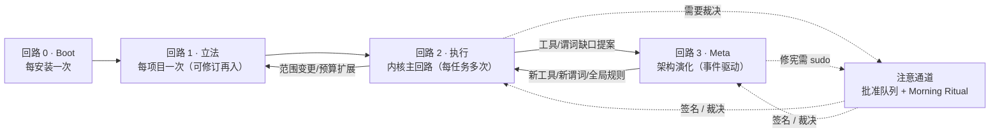
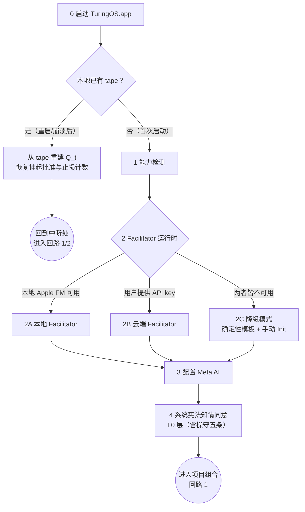
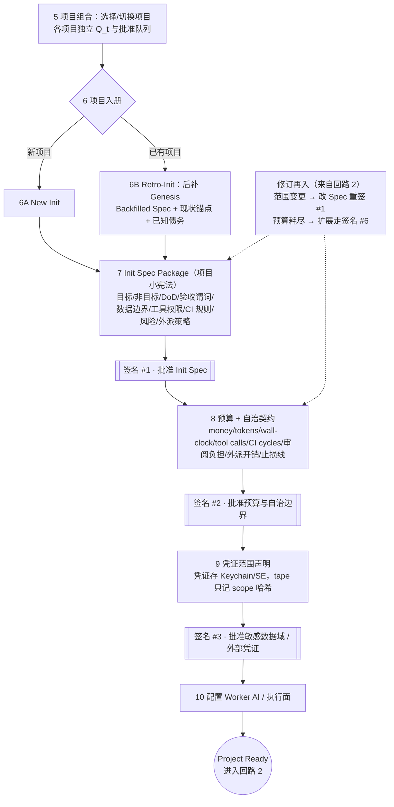
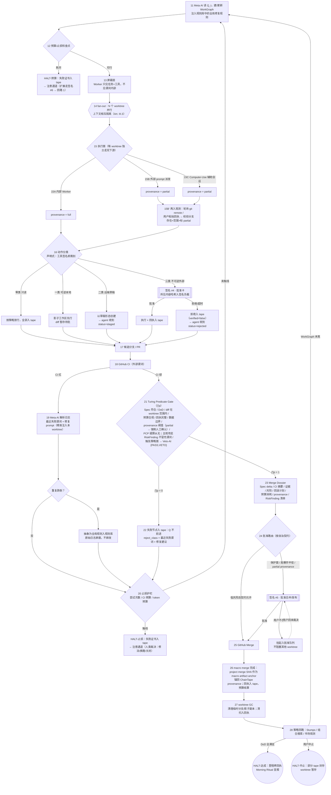
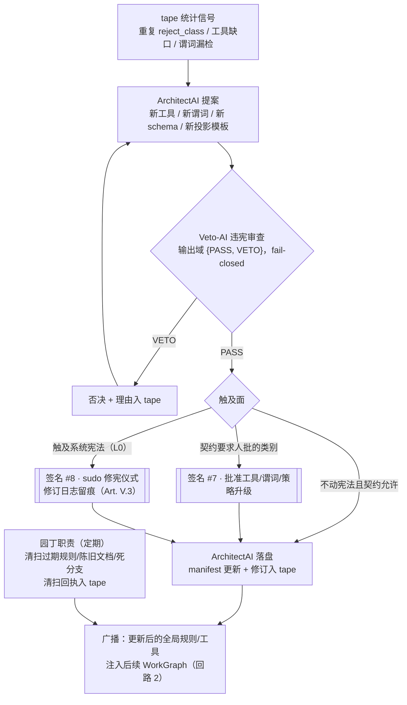

# Turing Agentic OS 白皮书 v0.6 — Two-Scale Sovereign Kernel Correction

**Apple-native × protocol-native 个人 Agentic OS：让 AI 在你的法律下自治**
**Internal ChainTape is the sovereign micro-ledger; GitHub is the macro execution substrate.**

版本 v0.6 · 2026-06-15 · 状态：在 v0.5 基础上完成「两尺度主权内核纠偏」（依用户 2026-06-15 终裁指令 + Veto-AI 全票核准，[审计规范存档](research/R_v06_directive.md)）——把 TuringOS 内部微观 ChainTape（主权微观账本）与用户项目 GitHub PR/CI/merge（宏观执行场）彻底分层，修正 §4.1 / §4.3 / §7.3 / §8 / §13.4 / §14.4 / §18 的同源尺度错配，新增 §7.0.1 图间连接契约（Flowchart Interface Contract）与 Approval Integrity Law。本版取代 v0.1 / v0.3 / v0.4 / v0.5。

> 配套文档：[FEASIBILITY.md](FEASIBILITY.md)（外部论断核验状态与来源，含 v0.5 调研附录 Part IV）· [research/R_agentic_os_sources.md](research/R_agentic_os_sources.md)（A1_11 论断库）· [research/R_v05_protocol_live_sources.md](research/R_v05_protocol_live_sources.md)（v0.5 论断库，41 条）。本版凡引外部事实，仅限两库内已核条目，措辞强度不超过其核验状态。

---

## 0. 一句话

**Turing Agentic OS 是一个 Apple-native、protocol-native 的个人 Agentic OS。它以 Facilitator AI 的动态气泡作为入口，以 Meta AI 编译用户意图，以 TuringOS Kernel 管理 Spec、预算、谓词、工作树、回执，并编排签名请求、验签与签名回执（私钥永不进入 daemon，§9），把外部模型、工具、技能与 Agent 全部变成受法律约束、有回执背书、可由人类签名的状态迁移。**

它不是另一个传统 macOS 应用，也不是另一个聊天机器人。它是一个把「人类意图 → 可执行法律 → Agent 行动 → 机器验证 → 人类签名 → 可回放状态变更」连成闭环的操作层。

> **AI 已经会动手。TuringOS 让它在你的法律下动手。**
>
> TuringOS is an Apple-native, protocol-native personal Agentic OS that turns external models, tools, skills, and agents into law-bound, receipt-backed, human-signable state transitions.

三权分明：**Apple-native 是产品体验与本地可信能力；protocol-native 是生态扩展能力；ChainTape、Predicate Gate、人类签名与 provenance 是 TuringOS 自己不可让渡的主权。**

> **两尺度主权（v0.6 核心定理，全篇之骨）**
>
> **Internal ChainTape is the sovereign micro-ledger. GitHub is the external macro execution substrate. A GitHub commit/PR/merge is not a ChainTape node; it is a macro artifact crystallized from many micro nodes and then anchored back into ChainTape as provenance.**
>
> 内部 ChainTape 是反奥利奥内核自己的主权**微观**账本（一次内核 tick / 一次 agent 提案 / 一次谓词判定 = 一个内部 tape node，失败也入带）；用户项目 Git / GitHub / PR / CI / merge 是外部**宏观**执行场与交付晶体。一次 GitHub commit/PR/merge **不是** ChainTape 节点，而是由许多微观节点晶出、再作为 provenance 锚回 ChainTape 的宏观产物。这不是降级 GitHub——是让 GitHub 回到它最擅长的位置（PR/CI/branch protection/merge），同时让 TuringOS 守住自己的主权（法律、谓词、签名、审计、失败记忆、预算、provenance、状态迁移）。

---

## 1. 版本沿革与本版修正

v0.1 把 Turing 描述为 macOS 上的 agent 治理层（安全带），强调同意、可见性、审计与可撤销。v0.2/v0.3 把它升级为 Apple-native 的个人 Agentic OS，并确立三项修正：

1. **从 Seatbelt 升级为 Agentic OS。** 外部 Agent 应当可接入，但 TuringOS 必须自带第一方运行时、第一方工具、第一方 Apple 集成与第一方 UI 哲学。外部 Agent 是执行面之一，不是产品成立的前提。
2. **从 setup helper 升级为 Facilitator AI。** 它是长期存在的用户操作协助员，可由 Apple Foundation Models 本地驱动或 API key 联网驱动——同一角色的两种 runtime。涉及 Git、ChainTape、项目理解、Init/Spec、任务分解与策略判断时，必须尽早引入 Meta AI。
3. **从传统 UI 改为 Software 3.0 界面。** 取消固定应用内菜单与左侧导航，取消把软件理解为页面集合。第一屏是动态智能气泡；界面是内核状态与用户意图的实时生成投影。

v0.4 在此之上完成三项工作：

1. **宪法对齐。** TuringOS 宪法（Art. 0 图灵机原教旨 / Tape Canonical / Q_t 三元组 / 量化·广播·屏蔽 / 三权分立）逐条映射到产品层（§4），凡宪法已有裁决处不发明新教义。
2. **Operating Flow 补全。** v0.3 的单线流程图缺终止态、止损护栏、并发语义、异步批准与 Meta 演化回路（审计判定 4 项 blocker + 13 项 major）。v0.4 以**四回路 + 一条注意通道**重画（§7）。
3. **回收 v0.1 诚实资产。** 操守五条、三类动作风险地图、覆盖边界横切声明、逐 agent 硬事实（Claude Code MCP-deny 缺口、Codex Cloud 例外等）在 v0.3 升级定位时丢失；产品形态变大，这些声明只会更必要，全部回收（§3 / §10 / §14 / §15）。

v0.5 依用户 8 条评审完成**定位升级：Apple-native → Apple-native × protocol-native**，闭合三个缺口：

1. **生态接口系统化。** MCP / A2A / MCP Apps / A2UI / AG-UI / SKILL.md / 模型 API 不再是零散集成点，而是一个有铁律的协议层（§13.6）+ Model Gateway（§13.7）+ View IR（§6.6）。原则一句话：**外部协议负责互操作；TuringOS 负责法律、谓词、签名、审计、状态迁移。**
2. **能力面底层白盒化。** 不做传统插件市场，做 **Capability Registry**（§13.8）：每个工具/技能/连接器都是带 manifest、权限、动作类、eval 与回执的可审计对象——Install ≠ trust。Skill Library（§13.9）与 Live Software 3.0 回路（§13.10）让系统在使用中演化白盒脚手架。术语纪律：反奥利奥架构是**顶层白盒（谓词与管理）/ 中间黑盒（agent）/ 底层白盒（工具）**三层——本文凡称"白盒工具/白盒能力"，一律指**底层白盒**，与顶层白盒严格分层、不得混称。
3. **安全模型升维。** Touch ID + SE 是 v0.x 的本地批准层；面对"宿主 OS 被完全攻破"的 AGI 威胁模型，v0.5 写入 **Hostile Host 公理**与两层安全架构（§9.1），不夸大 Secure Enclave 的能力边界。

v0.6 完成一次**主权内核纠偏**：v0.5 在把宪法 Art. 0 映射到产品层时，把 TuringOS 内部微观 ChainTape 与用户项目 GitHub PR/CI/merge 链路混成了一层，导致 `HEAD_t` / `wtool` / `∏p` / `tape_t` 全篇抓向外部项目仓库。v0.6 确立**两尺度模型**（§0 核心定理）并据此修正：

1. **尺度剥离。** `HEAD_t` 回归为内部 accepted-world 指针，不再等同 GitHub merge SHA；`wtool = internal bus.append()`，不再等同 git commit/merge（§4.1 / §4.3 / §8）。
2. **解开 Rubber 死锁。** 引入 `tape_tip` / `accepted_head` 双游标：append log 无条件前进（失败也入带，落实 Art. 0.2），accepted world head 仅 ∏p=1 时前进（落实 Art. 0.1）——不改宪法一字（§4.2）。
3. **图变协议。** 新增 §7.0.1 Flowchart Interface Contract：所有 flow chart 只能经类型化 ChainTape event 过缝，消除实现 agent 在图间接缝处的撕裂。
4. **批准完整性。** 写入 Approval Integrity Law：签名绑定的字节必须逐字节等于下游谓词门消费的 canonical 对象（§9）。
5. **用户意图入带。** 任何会影响状态迁移的用户意图，必须先以 `IntentCaptured` / `UserInstruction` 节点进入 ChainTape；未入带的 UI 对话只能是临时交互，不得作为后续放行依据（与 Tape Canonical 公理一致）。
6. **路线图纠时序。** Minimal Sovereign Kernel（内部 ChainTape append + Failure/Approval/Budget/Predicate 节点 + 基本 replay）前移到 M1——没有最小账本与谓词门，就没有 lawful execution loop，只有"会动手的 agent shell"（§18）。

> Phase 纪律：v0.6 是**白皮书层**纠偏（Phase A），只改顶层设计文档；契约 schema（Phase B）与实现重排（Phase C）各自走 Veto + compatibility + 签名/ratification，不夹在散文里（[审计规范](research/R_v06_directive.md)）。

---

## 2. TuringOS 要解决的问题

个人 AI Agent 正从"会聊天"进入"会动手"。它们会读写文件、操作浏览器、运行命令、安排日程、处理邮件、调用 MCP、生成代码、开 PR、执行外部工具。用户真正的问题不是"有没有 AI 能做事"，而是：

- 它到底在做什么？
- 它能不能在我睡觉时持续 loop？
- 它会不会越权？
- 它用了多少钱和多少时间？
- 它做错了能不能撤销？
- 它完成的东西凭什么能交付？
- 它给 Codex / Claude / Kimi / Grok 做的外部分派，TuringOS 还能不能治理？
- 如果 GitHub CI 失败，系统如何进入下一轮修复？
- 如果 GitHub CI 通过，谁决定可以 merge？

TuringOS 的回答不是频繁弹批准框，也不是裸奔 auto mode，而是 **Lawful Auto Mode**：先由用户批准 Spec、预算和自治边界，再让 Agent 在这些法律中自治。越界、不可逆动作、保护写入、预算扩展、修宪和高风险合并，才需要人类的物理签名。

---

## 3. 设计操守（产品的不可谈判项，先于一切功能）

继承自 v0.1，在 Agentic OS 形态下逐条重申。违反任何一条的功能，不做。

1. **只治理经由 Turing 通道的动作。** 第一方 Worker 经内核工具行动，治理完整；外部 Agent 自愿接入（MCP / CLI 包装 / hooks），接入即同意。我们不会、也无法静默监管你电脑上的一切——**我们绝不作此声称**。通道之外的动作面在 §14 与每个集成的边界卡中如实披露。
2. **不可逆动作默认是草稿。** 文件编辑这类可撤销动作在影子工作区暂存、批准后应用。发邮件、付款、发帖这类对外动作**无法真正撤回**——唯一诚实的设计是 draft-by-default：先存为草稿，经你签名确认后才执行。我们不向你承诺"撤回一封已发出的邮件"这种工程谎言。
3. **批准记录的是"你当时看到了什么"。** 每一次签名，连同批准卡所呈现内容的规范化哈希一起进入被签名的负载。事后回看时，你看到的不只是"批准了"，而是"基于什么批准的"。
4. **对 agent 诚实。** 当一个动作被暂存而非执行，返回给 agent 的结果必须如实说明（`status=staged` / 待批准 / 已拒绝），不让 agent 误以为动作已完成——否则它后续的计划会建立在假事实上。这是回路 2 中的显式回边，不是注释（§7.3）。
5. **本地优先。** tape、回执、批准历史存在你的电脑上，归你所有，可导出、可回放。TuringOS 不是一个把你的操作上传到别处的服务。模型辅助的呈现功能优先端侧。

### 3.1 它不是什么

- 不是杀毒软件，不是入侵检测——它不扫描、不拦截未接入的进程。
- 不是另一个替你决策的 agent——它不自动"纠正"你的 Agent，它执行你批准的法律。
- 不是合规监控——它是给你自己用的，不是给别人看你的。

---

## 4. 设计底座：TuringOS 宪法到产品的逐条映射

TuringOS 宪法把系统定义为一台真正的通用机器：paper 是 `tape_t`，pencil 是 append-only 写入，rubber 是失败提案不上升为新世界状态，strict discipline 是谓词、Veto-AI 与宪法约束。四要素任何一者缺失，系统都只是"近似图灵机"。本节是宪法条款到产品机制的映射表——凡仓库 ADR 已有裁决处直接引用，不另立教义。

### 4.1 四要素映射（Art. 0.1）

| Turing 1948 | 宪法对应 | 产品对应 |
|---|---|---|
| **Paper** | `tape_t` | **ChainTape**：append-only 的本地事实账本（动作、提案、批准、失败、回执全部入带） |
| **Pencil** | wtool append-only 写入 | 内核唯一写入口 `wtool = internal bus.append()`：**无条件**把每个 micro tick（一次动作 / 一次 agent 提案 / 一次谓词判定）追加为内部 ChainTape 节点。macro git commit/PR/merge 是更高一层、由许多 micro node 晶出的宏观动作（§8 Macro Boundary），**不是 wtool**，不在此口写入 |
| **Rubber** | 失败提案不上升为新状态 | ∏p=0 时 **accepted world state 不前进**（`accepted_head` 不动）——但失败**必须**作为 failure node 被 append（`verified=false` + `reject_class`）。即 append 无条件、accepted-world advance 有条件（§4.2 双游标）；draft-by-default 即 rubber 在对外动作上的形态 |
| **Strict discipline** | 谓词 + Veto-AI + 宪法 | Turing Predicate Gate + Veto-AI {PASS,VETO} + 三级法律层级（§4.4） |

### 4.2 Tape Canonical（Art. 0.2 / ADR-003）

> **所有信号必须可从 tape 重建。**

产品义务（ADR-003 已裁决为仓库法律）：

- **Git-backed ChainTape/CAS 是唯一 canonical truth。** UI 状态、缓存、索引一律是**派生投影**：可删、可重建，并以守恒测试（`view == derive_from_tape(tape)`）背书。
- 每个投影必须声明 `derive_source` / `schema_version` / `rebuild_command`（contracts/projection.schema.json 强制）。**Software 3.0 的生成式界面同样是派生投影，受同一纪律约束**——这是 §6 的物理基础。
- 失败分支（被否决 / 解析失败 / 谓词拒绝）必须以 `verified=false, reject_class=...` 形态入带——失败也是状态，是下一轮搜索的资产（§8.4 Failure Node）。
- cost / provenance / 预算消耗 / 市场观测 / 批准记录都不能只是 UI 状态或旁路账本——frozen tape 上必有充分信息可推导。
- ChainTape 节点带哈希链（Art. 0.3 的预留语义槽位）：每条目携带自身内容与前序哈希，启动时验链，篡改可检测。批准卡哈希（操守第 3 条）是这条链上的一类节点，不是孤立机制。

**双游标（v0.6 关键澄清）**：内部 ChainTape 上有两个互不等同的游标，消解"失败必须入 tape，但 ∏p=0 时 Q_t 不前进"的易误读点——

- **`tape_tip` / `log_tip`**：最新被 append 的内部 ChainTape 节点。**每个 micro tick 都推进它，失败也推进**（失败节点携 `verified=false` + `reject_class`）。
- **`accepted_head`（即 Q_t 的 `HEAD_t`）**：最后一个通过 predicate product 并被接受为当前世界状态的节点。**仅当相关 ∏p=1 时才推进**（宏观交付边界另有签名/自治契约放行，§8 Macro Boundary）。

也就是：**append log 无条件前进，accepted world head 有条件前进**。这不需要改宪法（Art. 0.1「失败不上升为新状态」与 Art. 0.2「失败也是状态、必须入带」各自成立、互不冲突），只需把产品语义讲清楚。GitHub 的 branch/commit/PR/merge 都**不是**这两个游标上的节点——它们是宏观产物，只能被某个 ChainTape 节点以 provenance 形式引用（§4.3 / §8）。

### 4.3 Q_t 三元组的产品映射（Art. 0.4）

宪法规定 Q_t = ⟨q_t, HEAD_t, tape_t⟩ 是 version-controlled 三元组，并指出"真 git substrate"（路径 B）是满分实现路径。**v0.6 关键澄清**：宪法路径 B 的物理底座是「**每 cell run 用 runtime 临时/内部 git repo；Node = commit object；bus.append = git commit；HEAD_t = git HEAD ref**」——这是 TuringOS **内部微观 ChainTape** 的实现底物，**不是**用户项目仓库、不是 GitHub PR、不是 merge commit。产品层据此落位：

| 宪法元素 | v0.6 产品落位 |
|---|---|
| `q_t` | 内核会话/搜索状态：WorkGraph cursor、pending approvals、stop-loss counters、routing state；必须可从 ChainTape 重建，崩溃后据此恢复 |
| `tape_t` | **Internal Micro ChainTape / CAS**：TuringOS 自己的 append-only canonical ledger（其满分实现可以是 runtime 内部 git repo） |
| `HEAD_t` | **internal accepted-world pointer**：指向内部 ChainTape 上最后一个通过 predicate product 并被接受为当前世界状态的节点。**不得等同于 GitHub merge SHA** |
| `tape_tip` / `log_tip` | 内部 ChainTape 最新 append 节点；失败节点也推进此游标，但**不**推进 accepted-world `HEAD_t`（§4.2 双游标） |
| `project_git_head` | 用户项目工作树 / 分支 / PR / merge SHA，属于 **macro execution substrate**；只能作为 provenance 或 macro artifact anchor 入 tape，**不是** Q_t 的 `HEAD_t` |
| `rtool` | 从 internal ChainTape + accepted head + project git observations + CI evidence 装配最小充分上下文（Art. III.2） |
| `wtool` | `bus.append()`：**只写 internal ChainTape**；不能直接等同 GitHub commit/merge |
| `macro_commit / PR / merge` | 由多个 micro node 晶出的外部交付产物；其 SHA 写入某个 ChainTape 节点的 `kind_payload` / provenance（§8 Macro Boundary） |

**一句话说清这层对齐**：用户 v0.3 选择"GitHub 继续做 PR/CI/merge，TuringOS 做治理场"是对的产品定位，但它落在**宏观尺度**——GitHub 是外部执行场与交付晶体，TuringOS 观察 `project_git_head`（PR/SHA/diff）、把 CI 当外部谓词、生成 Merge Dossier、决定是否让 Spec 下的世界状态前进。这与宪法 Art. 0.4 路径 B 是**两件事**：路径 B 讲的是内部微观 ChainTape 的 git 实现底物（runtime 内部 repo），**不是**把用户项目仓库当成 Q_t 的 substrate。ChainTape 作为主权微观账本记录 git 本身不记录的事实（批准、拒绝、预算、provenance），并把宏观 GitHub 产物以 anchor 形式收编为证据。

### 4.4 三级法律层级（Art. V.1.1 的产品化）

| 层级 | 载体 | 批准方式 | 修订方式 |
|---|---|---|---|
| **L0 系统宪法** | TuringOS 宪法（随产品分发，含本操守） | 安装时知情同意 | 仅人类 sudo + 签名#8，修订日志留痕（Art. V.3） |
| **L1 项目小宪法** | Init Spec Package + 预算与自治契约 | 签名#1 / #2 / #3 | 修订再入回路 1：范围变更重签 Spec；超预算走签名#6 |
| **L2 任务法** | WorkGraph 谓词 + 工具策略 | 自治契约范围内自动生效 | Meta AI 维护；触及策略面的升级走回路 3（Veto-AI + 必要时签名#7） |

人类不再规定"系统应该怎么做"，而是立法、批准预算、裁决例外。用户签的不是每一步，而是法律边界。

### 4.5 量化 · 广播 · 屏蔽：顶层白盒的三项产品义务（Art. I–III）

| 宪法条款 | 产品义务 |
|---|---|
| **量化 I.1** 布尔谓词 | 自然语言约束不够：意图必须编译为 Spec、预算、权限、验收谓词、CI、结构化校验。谓词输出域 {PASS,FAIL} |
| **量化 I.1.1** PCP 谓词 / 疑罪从无 | UI 合理性、文风这类无完美谓词的域：谓词退化为 PCP 形态（正确解绝不误杀，错误解高概率拦截）；**主观判断走独立 RiskFinding 通道附在 Merge Dossier 上供人类裁决，永不冒充谓词** |
| **量化 I.2** 统计信号 | 市场模块 v0 的观测量（预算消耗、重复失败、worker 可靠度、人类审阅负担）= 对 tape 的确定性统计，不含主观估值（§12） |
| **广播 II.1** 典型错误 | CI 失败 → 修复指引**精准注入**该 worktree；重复跌倒 → Meta AI 抽象为全局规则入规则库，注入后续 WorkGraph。**绝不把原始日志群发给所有 agent——那是上下文污染** |
| **广播 II.2** 价格信号 | 市场信号只作资源、优先级与注意力权重（探索/利用平衡见 §11），不替代谓词与签名 |
| **屏蔽 III.1** 园丁 / GC | 定期清扫过期规则、陈旧文档、死分支与影子副本；清扫动作本身入回执（§7.4） |
| **屏蔽 III.2** 封装细节 | Worker 的上下文是 rtool 装配的最小充分切片（目录式渐进披露），不是全量历史 |
| **屏蔽 III.3** 横向相关性 | 并行 worktree 的 Worker 上下文相互隔离：独立 tape 切片、独立会话线程，一个 worktree 的失败叙事不得污染另一个的规划上下文——否则群体智慧退化为单体智慧 |
| **屏蔽 III.4** Goodhart | Worker 收到"做什么、有什么工具"，**不收到谓词内部与评分细节**；它只通过 error message 感受边界。公开谓词（repo 内 CI）按其本性公开；内核侧验收检查（范围合规、Dossier 证据核对）保持在 Worker 不可读的区域 |

---

## 5. 角色系统

### 5.1 Facilitator AI

用户的操作协助员：首启引导、能力检测与解释、配置 Meta AI / Worker / GitHub / 权限 / 预算、解释当前状态、帮助理解 Spec 与失败、实时生成界面投影、作为自然语言入口。

推荐 runtime：本地 Apple Foundation Models 优先；设备不支持或用户选择云端时用 API-backed runtime。**它不是主规划器、也不拥有顶层白盒权威**：Facilitator 只做解释、引导与投影生成，放行裁决永远在 Kernel / 谓词手里。涉及 Git、ChainTape、项目理解、Init/Spec、任务分解与策略判断时，必须尽早交给 Meta AI。

### 5.2 Meta AI

主规划器、治理者、状态解释器，应该是用户能负担的最强模型。职责：读取 Git/ChainTape/Spec/GitHub PR·CI/历史回执；主持 Init 与 Retro-Init；生成 Spec、DoD、验收谓词、worktree 计划；生成预算与自治契约建议；分解任务并生成内部 Worker 与外部 Agent prompt；解析 CI 失败并生成修复 prompt；CI 通过后生成 Merge Dossier；维护策略回路与 Project Stumps。

Meta AI 不替代谓词。它可以解释和建议，但世界状态是否前进，取决于 Kernel 的 predicate product、Veto-AI、预算、权限和人类签名。

**宪法角色映射（v0.6）**：宪法 Boot 的本质是把人类 spec 编译成机器 predicates 并写入信任根，宪法里这个角色叫 **InitAI**。产品层不另造角色——**Meta AI is the product-facing embodiment of InitAI when it compiles law; it is only a black-box planner when it proposes actions.** 即：在 Boot / 立法阶段编译 Spec→Predicate Pack 时，Meta AI 行使 InitAI 的**顶层白盒**权能；在执行阶段提候选动作时，它退化为**中层黑盒** planner。权能随 mode 改变，且一切权能都由 Kernel 谓词中介。配套定位：Facilitator AI 无顶层权威；Worker AI / 外部 agent 是中层黑盒、只生成候选、不拥有放行权；Kernel / Predicate Gate / Veto-AI 是顶层白盒裁决系统。

### 5.3 ArchitectAI

宪法允许的架构改进提出者与实现者：新工具、新谓词、新 schema、新 tape 结构、新投影模板。按宪法 Art. V.1.2，ArchitectAI 有很高的演化权能，但 v0.6 把**落盘权限按变更类型分三层**（详见 §7.4），不得读成"任何新 schema / 新 tape 结构都可轻量上线"：

| 变更类型 | 例子 | 路由 |
|---|---|---|
| ordinary whitebox artifact | 新 skill、新 prompt wrapper、新投影模板 | Veto-AI PASS + eval，可按自治契约自动激活 |
| protocol-contract change | 新 node kind、新 schema、新 approval route、新 provenance enum | Veto-AI PASS + compatibility test + 签名 #7 / ratification |
| constitutional / substrate change | ChainTape substrate、Q_t 语义、Art. 0 路径选择 | 人类 sudo / 签名 #8 / 修订日志 |

默认可复用 Meta AI endpoint，但保持逻辑角色独立。**园丁职责挂在此角色下**（Art. III.1）：定期清扫陈旧规则与死分支。

### 5.4 Veto-AI

违宪否决者，输出域只有 **{PASS, VETO}**（Art. V.1.3）。它不做主观质量、性能、可读性、测试覆盖率评价——那些属于独立审计与 RiskFinding 通道。实现采用：确定性规则先行，快速模型处理明显案件，模糊高风险案件回落 Meta AI，**fail-closed**。

### 5.5 Worker AI

执行者，核心要求 **fast / low-latency / low-thinking / high-throughput**，不必一定 cheap。在 ChainTape 外部化思考之后，Worker 不承担重度战略推理：快速尝试、快速失败、快速回报、快速进入下一轮。可选形态：本地模型、本地服务、远程 API，或 Codex、Claude Code、Kimi、Grok 等外部 Agent。

### 5.6 角色即路由：按判据清晰度分配模型

五个角色构成一条与判据清晰度对齐的模型路由律——这不是成本偏好，是验证的非对称性使然：

- **判据可机械验证的工作**（回执审计、合规检查、明显违宪案件）→ 轻量模型甚至 rule-based 先行（Veto-AI 的确定性规则层、Facilitator 的模板句）。
- **可分解、判据需显式化的工作**（按既定 Spec 执行、结构化评审）→ Worker 档：快、吞吐高。
- **开放式、专家域、不可逆后果的工作**（立法、契约设计、策略裁决、Merge Dossier、终审）→ Meta 档：最强模型，**永不降档**。

---

## 6. Software 3.0 UI 哲学

### 6.1 反传统软件

TuringOS 不应该像传统 macOS 应用那样，左侧一个导航栏，中间一个无限画布，右侧一些属性面板。那是 Software 2.0 的遗产：用户在固定空间里寻找功能、点击菜单、管理对象。

> **软件不再呈现功能列表，而是呈现一个可对话、可生成、可治理的状态世界。**

设计指令：

- 禁止把左侧菜单栏作为主导航；
- 禁止把无限 canvas 当作主交互形态；
- 禁止把功能分区、页面、Tab 当作产品的第一组织原则；
- 第一入口必须是动态智能气泡；
- 用户诉求首先进入 Facilitator AI 或 Meta AI，而不是静态按钮；
- 系统回应不是切换页面，而是生成与当前任务相关的临时界面；
- 这些界面应当是 Generative HTML / Generative View / State Projection（宪法约束见 §6.3）；
- 所有界面都必须能追溯到 Tape、Spec、Budget、Policy 或 Receipt。

### 6.2 Dynamic Orb：第一屏

打开 TuringOS，用户首先看到的不是菜单，而是一个动态气泡。用户可以说：

- "帮我初始化这个项目。"
- "读取我最近活跃的 Git 项目。"
- "今天帮我规划三个 worktree。"
- "把这个任务分派给 Claude Code。"
- "解释为什么 CI 失败。"
- "哪些项目还没有 TuringOS Ready？"

气泡背后先由 Facilitator AI 接住用户，涉及深度项目理解时切换到 Meta AI。切换对用户不表现为"换页面"，而是对话深度和生成界面的变化。

### 6.3 Generative HTML / State Projection——以及它的宪法约束

界面不是预先写死的 dashboard，而是当前上下文生成的状态投影：初始化时生成权限说明与模型选择卡；Init 时生成 Spec 草案与风险问题；预算时生成预算雷达与自治边界卡；分派时生成 worktree map；CI 失败时生成最近失败谓词与修复 prompt；Merge 前生成 Merge Dossier；早晨生成 Morning Ritual。

约束（来自 §4.2，不是风格建议）：

- **模型可以生成呈现层，但不能生成放行逻辑。** 放行只来自谓词、契约与签名。
- **每一个生成式投影都是 tape 的派生视图**：声明 `derive_source` **与 source event hashes（它由哪些 ChainTape 节点哈希派生）**，可重建，可与 tape 对账。界面上的每个数字、每句结论都能下钻到产生它的事实节点——投影不只声明"来自 tape"，而声明"来自这些具体节点"。
- 生成失败或模型不可用时，优雅降级为确定性模板投影——呈现可以降级，事实不会丢失。

### 6.4 注意通道：安静即成功

Software 3.0 的另一半不是"问什么答什么"，而是"什么时候打扰你"。三定律：**注意力优先、语言优先、安静即成功。**

- 需要你裁决的事（批准队列、止损报告、失败证书）置顶呈现；
- 进行中的事低调呼吸；
- 一切安静时界面近乎空——安静不是没有信息，是系统替你扛住了信息。

注意通道是 operating flow 的一等公民（§7.5）：挂起的签名请求不阻塞其他 worktree，用户回来时一次性裁决。其具体物理载体（orb 脉动、系统通知、常驻微标）属 UI 设计轨，由设计稿另行裁决——本白皮书只锁定通道语义。

### 6.5 人类在 UI 中的角色

人类不是菜单操作员。人类是：意图提供者、Spec 批准者、预算批准者、不可逆动作批准者、高风险 merge 批准者、宪法维护者、异常与例外的裁决者。所有日常微操作都应由系统在已批准法律下自动推进。

**意图入带（v0.6，M8）**：人类作为意图提供者，凡会影响状态迁移的意图必须先以 `IntentCaptured` / `UserInstruction` 节点入 ChainTape——未入带的 UI 对话只是临时交互，**不得作为后续放行依据**（与 Tape Canonical 公理一致，§4.2）。这保证 §6.3 的"实时生成投影"不会让非 tape 源偷偷成为事实源。

### 6.6 Turing View IR：生成式界面的统一中间表示

生态正在收敛到"工具/agent 返回界面"：MCP Apps 已成为首个 official MCP extension（2026-01；与 OpenAI 联合制定，Apps SDK 即建于 MCP 之上）；Google 的 A2UI（v0.8，官方自述 early-stage）与 CopilotKit 的 AG-UI 是另两条路线。TuringOS 的姿态：

- 所有外来 UI 描述（MCP Apps 组件 / A2UI / AG-UI / 未来格式）先翻译为 **Turing View IR**，再由第一方渲染器投影——适配在边缘，渲染权在内核。MCP Apps 为优先适配目标；A2UI/AG-UI 只做 adapter，不深度锁定。
- View IR 投影与一切投影同律（§4.2）：声明 `derive_source` 与 source event hashes，可重建，可与 tape 对账。
- **第三方生成的 UI 是不可信内容**——它可以呈现信息，但有两条铁律：① **批准卡永远由第一方渲染器绘制，任何第三方 view 组件不得承载批准仪式**（否则"批准时所见"的哈希就建立在对手可控的像素上）；② 第三方 view 发起的动作请求与其它通道的动作请求同等过门——分类、谓词、签名一个不少。

### 6.7 Canvas Projection：无边界呈现的诚实路径

无边界画布是对的阅读形态，但路径必须诚实（来源见 FEASIBILITY Part IV）：**Apple Freeform 当前的全部公开自动化面只有一个 Shortcuts 动作（Add Files to Board）**——无创建看板 API、无 AppleScript 字典、无公开文件格式。所以：

1. **v1 自建 Canvas Projection**：Markdown AST → 布局图 → 第一方渲染（嵌入式画布候选 Excalidraw，MIT 可自由商用；tldraw 生产部署需商业 license，列为次选）。每个画布节点带 `derive_source`，派生自 Markdown / Spec / ChainTape / Receipt——画布不是第二事实源。可导出 PDF/PNG/HTML/Markdown。
2. **Freeform 只做导出/分享桥**（用户手动），若 Apple 日后开放官方 API 再建 bridge。**不逆向 Freeform 私有格式**——那违背可维护性与分发诚实。

---

## 7. Operating Flow v4：四回路 + 一条注意通道

v0.3 的单线流程图被审计判定存在结构性缺口（无终止态、无止损、无并发、无 Meta 回路、8 个签名节点只画了 3 个）。v0.4 把流程拆为四个回路：**Boot（每安装一次）→ 立法（每项目一次）→ 执行（内核主回路）→ Meta（架构演化）**，加一条横贯全部回路的**注意通道**。

### 7.0 总览



### 7.0.1 Flowchart Interface Contract（图间连接契约）

§7 把流程拆成 Boot / 立法 / 执行 / Meta / 注意通道五张图。每张图只说明本图内部流程，**跨图边界必须是类型化对象**，否则不同实现 agent 会各自脑补接缝、在交叉地带撕裂。本节不讲愿景，只讲硬接口。所有 flow chart 都是同一台 canonical machine 的投影：

```text
All flow charts in this white paper are views over one canonical machine:
Q_t = ⟨q_t, accepted_head_t, tape_t⟩.
No flow chart owns private state that cannot be reconstructed from ChainTape.
No flow chart may pass control to another flow chart except by appending a typed ChainTape event.
There are two distinct cursors:
- tape_tip: the latest appended ChainTape node; advances on every micro tick, including failure.
- accepted_head: the latest verified world-state node; advances only when the relevant predicate product and approval route pass.
GitHub branch / commit / PR / merge are macro artifacts.
They may be referenced by ChainTape nodes but are not themselves ChainTape nodes.
Every cross-loop arrow MUST specify:
- event_type
- canonical schema
- hash binding
- required signature, if any
- replay / derive rule
```

两条硬约束：

- **过缝只能经 ChainTape event。** 禁止通过 UI local state、agent memory、parallel cache、GitHub side effect 直接过缝。
- **每条跨图箭头必须声明**：`source_loop` / `target_loop` / `event_type` / `canonical_payload_schema` / `required_hashes` / `approval_binding` / `replay_command`（或 `derive_rule`）。

最少 12 类过缝事件（v0.6 锚定；schema 落地属 Phase B，走 ratification）：

| 接缝 | 事件类型 | 必要字段 |
|---|---|---|
| Boot → 项目组合 | `SystemConstitutionAccepted` | constitution_hash, user_consent_hash, runtime_capability_digest |
| Boot → 立法 | `ProjectDiscovered` | repo_locator, observed_git_head, project_fingerprint |
| 立法 → 执行 | `ProjectReady` | init_spec_hash, budget_contract_hash, credential_scope_hashes, predicate_pack_hash |
| 立法修订 → 执行 | `ProjectLawAmended` | previous_law_hash, new_law_hash, signature_id |
| 执行 → 注意通道 | `SignatureRequested` | action_kind, approval_card_hash, expiry, route |
| 注意通道 → 执行 | `SignedDecision` | request_hash, decision, signature, signer_key_id |
| 执行 → Meta | `ArchitectureGapObserved` | reject_class_cluster_hash, missing_tool/predicate/schema |
| Meta → 执行 | `WhiteboxArtifactActivated` | artifact_hash, veto_result, eval_result, signature_if_required |
| 执行 → 立法 | `ScopeChangeRequested` | diff_from_spec, reason, suggested_amendment |
| 执行 → 立法 | `BudgetExhausted` | budget_line, consumed, forecast, stop_loss_certificate |
| 执行 → 宏观 Git | `MacroArtifactProposed` | micro_trace_hash, diff_hash, PR_url/SHA, provenance_level |
| 宏观 Git → 执行 | `MacroObservationImported` | CI_status, logs_digest, merge_sha, branch_protection_state |

这把"图"变成了"协议"：任何实现 agent 看到 flow chart，都知道过缝时必须读写哪个类型化对象、绑定哪些哈希、是否需要签名——而不是自由脑补。末两行 `MacroArtifactProposed` / `MacroObservationImported` 正是内部微观尺度与外部宏观 GitHub 之间唯一的合法过缝：micro trace 晶出宏观产物、宏观观测（CI / merge SHA）被收编回带，两侧都带哈希，绝不让 GitHub side effect 直接改内部状态。

### 7.1 回路 0 · Boot（每安装一次）+ 崩溃恢复



Boot 即宪法 Art. IV：把人类规范编译为机器谓词并写入信任根的过程在产品层分两段——L0 随安装完成，L1 在每个项目的立法回路完成。Boot 之后系统不再需要被"提起来"第二次：**崩溃恢复不是重新 Boot，而是从 tape 重建 Q_t**（Art. 0.2 的直接收益）。

### 7.2 回路 1 · 立法（每项目一次，可修订再入）



要点：

- **没有 Init Spec 的项目不能执行普通任务，只能运行 readiness task。**
- 凭证从不入带、从不入 prompt：执行面派发时由 Keychain/SE 注入运行环境，tape 记录的是凭证范围哈希（用了哪个 scope），不是凭证本身。
- 立法不是一次性的：回路 2 的止损与范围检查会把项目送回这里**修订再入**——签的是法律，法律可以修，但修法本身要签名。
- **Project Ready 不是一个图节点，而是一个 typed event**：`ProjectReady{init_spec_hash, budget_contract_hash, credential_scope_hashes, predicate_pack_hash}`（§7.0.1）。它是立法回路向执行回路过缝的唯一合法对象——执行回路读到的"这个项目可以跑了"必须能从这四个哈希重建，而不是某个 UI 标志位；范围/预算修订经 `ProjectLawAmended{previous_law_hash, new_law_hash, signature_id}` 再过缝。

### 7.3 回路 2 · 执行（内核主回路）



逐点说明（对应图中编号）：

- **12 预算检查点**：预算在三处被触碰——派发前检查（12）、CI 完成后扣减（18 之后计入止损护栏 20）、merge 后结算（26）。预算与止损线来自签名 #2 的自治契约，不是内核拍脑袋。
- **13 屏蔽层（Goodhart）**：Worker 收到"做什么、有什么工具"，不收到谓词阈值与评分内部。公开的 CI 按其本性公开；内核侧验收检查保持在 Worker 不可读区域。
- **14 并发与隔离**：每个 worktree 独立走 15→21 的全程，**谓词门逐 worktree 触发**；一个 worktree 的失败不中止其余（组合层面的中止由止损护栏与用户裁决）。隔离是宪法义务（Art. III.3）：独立上下文、独立会话，失败叙事不横向传染。
- **15B' 外部派发的再入**：复制给 Codex/Claude Code 的任务不会"自动出现"在流程里——内核以观测触发再入：轮询 git remote 发现新分支，或用户把产物粘回；校验分支存在、diff 范围、标注 `provenance=partial` 后才进入动作分类。**外部 Agent 若不经 TuringOS 通道执行，只能生成 repo 级 / PR 级回执，不得声称拥有动作级回执。**
- **16 动作分类**：声明式，工具签名即类别（§10 三类动作）。模型产出的摘要与标签仅用于呈现，永不进入分类与放行路径。来自 Capability Registry 的第三方能力以其 manifest 声明的类别入门；**未声明或无法核验类别的能力 fail-closed——按三类（不可逆外部）处置或直接拒绝**（§13.8）。
- **staged 诚实（操守 #4）**：DRAFT 与 REJ 节点的回边是流程的一部分——agent 同步收到 `status=staged/rejected`，据此绕开该动作继续规划，而不是重试同一动作。
- **20 止损护栏**：CI 修复回路（18→19→11）与谓词失败回路（22→20→11）共用同一护栏——尝试次数、CI 预算、token 预算任一触线即 HALT-止损，失败证书入 tape，人类在注意通道裁决：修法（回路 1）、换路（策略回路）、或关闭。**没有无界重试。**
- **21 谓词门**：CI 绿只是外部谓词之一。门内是 predicate product：任何一项 FAIL 则 ∏p=0，Q 不前进。partial provenance 的候选**不允许纯谓词放行**——强制升格为人工确认（24 路由至签名 #5）。
- **23 Merge Dossier**：由 Meta AI 生成、由 Kernel 约束结构。RiskFinding 清单（PCP 域的主观发现）附于其上供人类裁决——主观判断有通道，但不冒充谓词。
- **21→25 是 Macro Boundary（§8）**：CI 绿后的谓词门产出 `Πp_macro`；但放行是 `macro_merge_allowed = Πp_macro ∧ budget/provenance gates ∧ approval_route_valid`，其中 `approval_route_valid = autonomy_contract_allows ∨ human_signature(#5)`。`Πp_macro = 1` 是 macro merge 的**必要不充分**条件——这条形式化把图中 21→24→25 的隐含层级写死，杜绝"CI 绿即可合"的误读。
- **26–27 收尾**：macro merge 完成后，project merge SHA 作为 **macro artifact anchor** 锚回某 ChainTape 节点的 provenance（经 `MacroObservationImported` 过缝，§7.0.1）——**它不是 `HEAD_t`**，`accepted_head` 仍是内部 ChainTape 节点；回执与预算结算入 tape；GC 清理并留痕。

### 7.4 回路 3 · Meta（架构演化，事件驱动）



这是 v0.3 流程图完全缺失的回路：系统的自我进化不混在任务流里，而是独立的三权分立回路——ArchitectAI 提案（突变）、Veto-AI 审查（选择）、宪法与签名（机制）。修复规则库由此回路维护，回路 2 只消费。**Live Software 3.0（§13.10）不是新回路，而是本回路的数据飞轮扩展**：tape 上的失败与使用数据经本地小模型聚类后，成为 ArchitectAI 提案的输入——入口不变、闸门不变。

**三层落盘纪律（v0.6，承 §5.3）**：图中"不动宪法且契约允许 → 落盘"必须按变更类型细分，不能让协议级变更搭便车——① **ordinary whitebox artifact**（新 skill / prompt wrapper / 投影模板）→ Veto-AI PASS + eval，可按自治契约自动激活；② **protocol-contract change**（新 node kind / 新 schema / 新 approval route / 新 provenance enum）→ Veto-AI PASS + compatibility test + **签名 #7 / ratification**，绝不自动落盘；③ **constitutional / substrate change**（ChainTape substrate、Q_t 语义、Art. 0 路径选择）→ 人类 sudo / 签名 #8 / 修订日志。这既尊重宪法给 ArchitectAI 的演化空间，又堵死"任何新 schema / 新 tape 结构都可轻量上线"的误读。

### 7.5 注意通道与 Morning Ritual

- **挂起不阻塞**：任何签名请求（#4/#5/#6）在用户不在场时进入批准队列，所属 worktree 挂起，**其余 worktree 照常推进**。
- **打扰有门槛**：通道按三定律呈现——需裁决的置顶，进行中的呼吸，安静即成功。
- **Morning Ritual 是 tape 的 reduce**：每天早晨对昨夜 tape 做一次确定性归并——Done / Staged / Needs Approval / Blocked / Failed 五栏，每项可下钻到证据。失败项不是日志垃圾，是 Failure Certificate 和下一轮建议。
- 这对应宪法 Art. IV 的 map-reduce tick：呈现是周期性的派生计算，不是另一份账本。

### 7.6 终止态分类（HALT taxonomy）

| 终止态 | 触发 | 入 tape 的内容 | 下一步 |
|---|---|---|---|
| **HALT-达成** | DoD 全满足 | 里程碑回执 + HEAD 锚 | Morning Ritual 呈报；项目可关闭或开新 WorkGraph |
| **HALT-预算** | 预算耗尽 | 失败证书 + 已消耗明细 | 签名 #6 扩展 → 回路 1，或关闭 |
| **HALT-止损** | 重试触线 / 不可解谓词失败 | 失败证书 + reject_class 史 | 人类裁决：修法 / 换路 / 关闭 |
| **HALT-中止** | 用户主动中止 | 部分 tape 封存 + worktree 暂存清单 | 可恢复（tape 重建）或 GC |
| **崩溃** | 进程死亡 | （无新增——tape 本就逐事件落盘） | 重启 → 从 tape 重建 Q_t（§7.1） |

---

## 8. TuringOS Kernel

Kernel 是整个 operating flow 的中心，不是 UI 的后端附属物。它在**两个互不等同的尺度**上运转（§0 核心定理）：内部微观 ChainTape 的 **Micro Tick**，与用户项目 GitHub 的 **Macro Boundary**。两尺度共用同一前段（装配 → 黑盒提议 → 顶层白盒裁决）：

```text
Q_t = ⟨q_t, accepted_head_t, tape_t⟩         # tape_t = internal Micro ChainTape / CAS
        ↓ rtool
input = accepted_head + 相关 tape 切片 + spec + project_git 观测 + CI 证据（最小充分上下文）
        ↓
Middle Blackbox = Meta AI / Worker AI / 外部 agents
        ↓
output = 候选动作 / 分支 / 工具提案 / 策略提案
        ↓
Top Whitebox = 谓词 ∏p + Veto-AI + 预算/止损 + provenance 阈值 + 屏蔽
```

**Micro Tick（内部微观尺度——每一次内核 tick / 提案 / 谓词判定）**：

```text
Micro Tick:
    node = bus.append(output, Πp_micro, verified, reject_class, provenance, cost, parent_hashes)
    # append 无条件：tape_tip 永远前进，失败也入带（Art. 0.2）
    if Πp_micro = 1:
        node.verified = true
        accepted_head advances to node           # 仅此时 accepted-world 前进
    else:
        node.verified = false
        node.reject_class is mandatory            # 失败是状态，下一轮搜索的资产（§8.4）
        accepted_head does NOT advance            # Rubber（Art. 0.1）：世界状态不前进，但已记录在带
```

**Macro Boundary（外部宏观尺度——交付晶体的放行）**：

```text
Macro Boundary:
    macro_candidate = crystallize(micro_trace → commit / PR / MergeDossier)
    macro_merge_allowed iff:
        Πp_macro = 1                                          # CI 等外部谓词 + 内核验收门
        AND budget / stop-loss / provenance gates pass
        AND (autonomy_contract_allows OR human_signature_valid)   # 签名 #5 或自治契约放行
    # merge 成功后：project merge SHA 作为 macro artifact anchor 写回某 ChainTape 节点的 provenance
    # —— 它不是 accepted_head；accepted_head 永远是内部 ChainTape 节点
```

三点一次说死：

1. **append 无条件 / accepted-world advance 有条件 / macro merge 是更高一层 macro action**——三者不是同一个动作。`wtool = bus.append()` 只写内部 ChainTape；GitHub commit/PR/merge 不是 wtool 写入，而是由许多 micro node 晶出的宏观产物。
2. **`Πp_micro = 1` 让 `accepted_head` 前进；`macro_merge_allowed` 在 `Πp_macro` 之上还要 budget/provenance 门与（自治契约 OR 人类签名）**——`∏p=1` 在宏观 merge 层只是必要条件，不是充分条件（§7.3 批准路由）。
3. **GitHub merge SHA 永不是 `HEAD_t`**——它作为 macro artifact anchor 锚回某个 ChainTape 节点的 provenance；内部 accepted-world 仍由内部 ChainTape 节点定义。

> 与 v0.3 的一处显式修正（保留）：v0.3 此图把 market signal 列在 Top Whitebox 的放行行里。依宪法 Art. I.2 / II.2 与 v0.3 自己的 §10（"Market signal ≠ predicate truth"），市场信号是统计/广播信号，永不进入 ∏p——v0.4 将其移出放行行，替以 provenance 阈值。市场信号的位置在 §12。
>
> 与 v0.5 的尺度修正（v0.6）：v0.5 此图写 `if ∏p = 1: wtool 提交 Q_{t+1}（tape 追加 + HEAD 前移）` / `if ∏p = 0: Q_t 不变，失败以 verified=false 入 tape`——既把"tape 追加"放进 `∏p=1` 分支（颠倒 Rubber，让实现者误以为失败不 append），又把 `HEAD_t` 与 GitHub merge 链路混为一谈。v0.6 拆成 Micro Tick 与 Macro Boundary 两条方程，一次修掉尺度混淆、Rubber 颠倒、签名漏门三个问题。

### 8.1 Bottom Whitebox

读取与执行：Git、Tape、Spec、Policy、工具 manifest、GitHub 状态、CI 证据、外部 Agent 产物。rtool 按 Art. III.2 装配最小充分上下文。

### 8.2 Middle Blackbox

提议：Meta AI 规划、Worker AI 执行、外部 Agent 生成候选。黑盒内部推理不被信任，系统只信可观察、可验证、可重建的行为结果。**黑盒与其模型供应商之间的流量对 Kernel 不可见——这是形态边界，不是实现疏漏（§14.2 横切边界）。**

### 8.3 Top Whitebox

量化、广播、屏蔽（义务表见 §4.5）：量化 CI/tests/预算/范围/回执/provenance；广播典型错误抽象、策略树桩、价格信号、修复规则；屏蔽坏日志、Goodhart 细节、横向相关性污染、过期上下文。

### 8.4 Failure Node

失败不是垃圾。失败必须入 tape：`reject_class`、最近失败谓词、尝试摘要、预算消耗、修复建议、provenance。它是下一轮搜索的资产，也是回路 3 的统计输入。

**这不是一个独立机制，而是 §8 Micro Tick 的无条件结果**：`bus.append()` 对每个 tick 都建节点，失败 tick 产出的就是 `verified=false` + `reject_class` 的 failure node；它推进 `tape_tip` 但不推进 `accepted_head`。"失败也是状态"在物理上由 append 的无条件性保证，不靠任何额外的"记得写日志"约定。

---

## 9. 签名节点（Touch ID）

签名不是微操作确认器。它是法律边界、不可逆动作和保护写入的物理签名。八个节点在四回路中的位置：

| # | 节点 | 所在回路 / 流程位置 |
|---|---|---|
| 1 | 批准 Init Spec / Project Ready | 回路 1（图 7.2 H1）；范围变更重签亦在此 |
| 2 | 批准预算与自治契约 | 回路 1（H2） |
| 3 | 批准敏感数据域 / 外部凭证 | 回路 1（H3，凭证范围声明之后） |
| 4 | 批准不可逆外部动作 | 回路 2 三类动作支路（H4） |
| 5 | 批准保护写入 / merge / release / publish | 回路 2 批准路由（H5）；partial provenance 强制走此 |
| 6 | 批准超预算扩展 | HALT-预算 → 注意通道 → 回路 1 修订再入 |
| 7 | 批准工具 / 谓词 / 策略升级（契约要求时） | 回路 3（H7） |
| 8 | 修宪 / sudo 仪式 | 回路 3（H8），修订日志留痕 |

每个签名节点都是一个 typed 过缝事件（§7.0.1），绑定 canonical 对象哈希，状态如实分版本：

| # | 过缝事件 / 绑定对象 | action_kind | 状态 |
|---|---|---|---|
| 1 | `SignedDecision` 绑 `InitSpecPackage` hash | approve_init_spec | beta（应用内批准过渡形态） |
| 2 | `SignedDecision` 绑 `BudgetAutonomyContract` hash | approve_budget | beta |
| 3 | `SignedDecision` 绑 `CredentialScopeDeclaration` hash | approve_credential_scope | beta |
| 4 | `SignedDecision` 绑 `ApprovalCard` hash | approve_irreversible_action | M1（draft-by-default 即生效；SE 签名按路线图升级） |
| 5 | `SignedDecision` 绑 `MergeDossier` + `MacroArtifactAnchor` hash | approve_macro_merge | M1（路由）/ M2（SE 签名） |
| 6 | `SignedDecision` 绑 stop_loss_certificate hash | approve_budget_extension | M1 |
| 7 | `SignedDecision` 绑 protocol-contract diff hash | approve_protocol_change | M3（Live 回路）/ ratification |
| 8 | `SignedDecision` 绑 constitution 修订 hash | sudo_amend_constitution | 远期（Tier 2 / Hostile Host） |

> 注：v0.3 流程图只画了 3 个签名节点，且把"批准 merge"标为 Touch ID #3——而 v0.3 自己的 §8 清单已把 #3 定为凭证域、#5 定为保护写入。v0.4 依清单统一编号（merge 归 #5），并把 #3/#4/#6/#7/#8 全部画进对应回路，消除图与清单的不一致。

密码学形态与诚实边界（细节与来源见 [FEASIBILITY.md](FEASIBILITY.md)）：

- Secure Enclave 驻留 P-256 签名私钥，访问控制 `.privateKeyUsage + .biometryCurrentSet`：每次签名要求一次新鲜 Touch ID 手势（重用时长 0），私钥永不离开 SE；指纹重录自动作废钥匙——换了手指，就该重新建立信任。
- **SE 签的是字节，不能证明你看到了什么。** 所以批准卡内容（agent 名、动作、目标、参数摘要、风险类别、可逆性）的规范化哈希由应用计算并**纳入被签名的负载**——签名绑定的是"这张卡"，回放时验的也是"这张卡"。
- **Approval Integrity Law（v0.6 铁律，贯穿所有过缝对象）**：any signed approval must bind exactly the canonical bytes consumed by the downstream predicate gate. No summary, projection, view, or model-generated explanation may substitute for the canonical object hash. 即——用户签名时看到的对象，必须**逐字节等于** Predicate Gate / Kernel 后续校验的对象；绝不允许"签的是 UI 摘要、校验的是另一个 JSON"。这把 §6.6"批准卡永远第一方渲染"从像素层提升到哈希层：Init Spec、预算、自主契约、凭证范围、Merge Dossier 的**签名哈希 ≡ 下游谓词消费哈希**（落地 schema `InitSpecPackage` / `BudgetAutonomyContract` / `CredentialScopeDeclaration` / `ApprovalCard` / `SignedDecision` / `MergeDossier` / `MacroArtifactAnchor` 属 Phase B）。
- 批准仪式发生在 GUI 应用里，不在后台 daemon 里——daemon 只验签、永不持有人类根私钥（ADR-005）。
- macOS 27 起 App Attest 登陆 Mac 并在 attestation 证书携带 SE 访问控制条件，为未来第三方审计方确认"这把钥匙确为生物识别门控"提供升级路径。
- **过渡说明**：v0.x 早期版本以应用内明确批准门控（非生物识别），draft-by-default 自第一版即生效；Touch ID + SE 签名按路线图（§18）升级——能力边界如实分版本陈述。

### 9.1 Hostile Host 安全模型：威胁阶梯与两层架构

签名仪式防什么，必须按威胁分级说清（先例与来源见 FEASIBILITY Part IV）：

| 威胁级 | 对手 | 防御 | 状态 |
|---|---|---|---|
| **T0** 善意故障 | bug、误操作 | 谓词门 + draft-by-default + 还原点 | v0.x 全覆盖 |
| **T1** 恶意能力 | 恶意 skill/工具/MCP server | Capability Registry fail-closed + 动作分类 + 签名#4/#5 | v0.x 覆盖（限通道内） |
| **T2** 被注入/被劫持的 agent | prompt injection、被攻陷的外部 agent | 有后果动作过门 + 批准卡第一方渲染 + provenance 阈值 | v0.x 覆盖（限通道内；注入本身不可根除，§14.2） |
| **T3** 敌意宿主 | 宿主 OS 被 AGI/恶意软件完全控制 | **本机任何 UI、哈希、验签都可被篡改**——需要宿主之外的锚 | v0.x **不防，且如实声明不防** |

**Hostile Host 公理（写进产品而不是藏起来）**：若批准的验证、审计的记录或最终的执行只发生在可能被攻破的宿主 OS 之内，TuringOS 不得宣称 AGI 级 sudo 安全。Secure Enclave 保护的是私钥，不能在宿主被完全攻破时保证"你真实看到的 UI"与"被签名的字节"一致（WYSIWYS）。

两层架构：

- **Tier 1 · Mac 本地批准签名器（v0.x，§9 正文）**：SE + Touch ID + 所见哈希入负载。覆盖 T0–T2，是消费级威胁下的正解。Apple Watch 的 `deviceOwnerAuthenticationWithWatch` 可作为在场因子叠加，但表上只能显示通用批准 UI、无法呈现自定义动作详情——它增强在场性，不构成独立可信显示，我们如实归入 Tier 1。
- **Tier 2 · 外部 Sudo-Anchor（路线图远期，T3 答案）**：独立显示 + 物理确认按键的宿主外设备；Audit Anchor（Merkle 包含证明的追加式日志，Sigstore Rekor 模式）；独立于宿主的 Execution Gate；批准 token 绑定 HEAD_t、audit_head_t、gate_id、nonce、计数器与时效；**无审计包含证明则不执行（no-audit-no-execution）**。

Tier 2 不是空想，是成熟模式在 agent 时代的重述：硬件钱包的安全屏（签名与显示同一安全域）、银行 chipTAN（独立设备显示交易内容，PC 被木马也改不了已确认的交易）已验证此路三十年；2026-05 面世的 Foundation Passport Prime 自称首个 "Human Authority Hardware"，证明品类正在成形。反面边界同样如实：FIDO2 的交易确认扩展已关闭未合并（现役硬件 key 无可信显示），学术界（OAP 等）自陈不防 compromised runtime——T3 仍是 open problem，TuringOS 把它列为路线图研究项，不列为已解承诺。

---

## 10. 三类动作：一张诚实的风险地图

所有经由通道、会产生副作用的动作分为三类（只读是零类）。**分类即策略**：类别由声明式工具签名决定（§7.3 节点 16），决定默认处置。

| 类别 | 例子 | 默认处置 | 撤销真相 |
|---|---|---|---|
| **零类：只读** | 读指定目录、查日程、读 PR 状态 | 按策略自动允许；全部入 tape | 无副作用 |
| **一类：可逆本地** | 移动/编辑文件、改代码、建分支 | 影子工作区先行；批准后应用；保留还原点 | 真撤销（应用前丢弃 / 应用后还原） |
| **二类：可暂存远端草稿** | 邮件草稿、暂定日程、文档草稿 | 直接以"草稿"形态创建在目标系统；最终发送仍属三类 | 草稿可删；不假装"发送可撤销" |
| **三类：不可逆外部** | 发邮件、付款、发帖、提交表单、删远端数据 | **永远不自动执行。** 批准卡 + 签名 #4；所见哈希入签名负载 | **无法撤销，前置同意是唯一保护** |

批准卡上永远写明动作属于哪一类、能否撤销。我们不用模糊的"安全/不安全"，而用"可逆/不可逆"这种可被检验的语言。撤销的实现诚实：还原点由影子工作区自身的版本化提供，不依赖、不承诺系统级快照还原（理由见 §13.3）。

**分类结果本身是一个 typed node**：动作被判为哪一类、依据哪条工具签名，作为 ChainTape 节点入带（不是 UI 临时标签）——它是 §8 Micro Tick 的一类输出，可回放、可审计。模型产出的摘要与标签只用于呈现，永不进入分类与放行路径（§7.3 节点 16）。

---

## 11. Project Strategy Loop：项目树桩与 MCTS-lite（TBD）

复杂项目不是线性任务，而是策略树。Meta AI 应主动帮助用户生成 Project Stumps（项目拓展树桩）：一个可能的产品方向、一条可验证的技术路线、一个 worktree arm、一个实验假设、一个风险隔离分支、一个候选 PR、一个文档/架构/市场方向。

v0.4 维持 v0.3 的裁决：先采用 **portfolio search + 可见策略树**，不立即实现全自动的不透明 MCTS。MCTS-lite 的候选定义：

- Node = Project Stump / Worktree / PR candidate；
- Edge = WorkTx / agent attempt；
- **Hard gates（准入闸门，不是 reward；任一不过则候选根本不进入排序）**：`predicate_pass`、`CI_pass`、`budget_compliance`、`required_approval_valid`、`provenance_threshold`；
- **Ranking / portfolio signal（过闸之后才参与排序）**：`expected_user_value`、`uncertainty_reduction`、`cost`、`risk`、`diversity_bonus`、`strategic_option_value`；
- Exploration / Exploitation 平衡受 Art. II.2.1 约束：价格信号引导注意力但不得抹杀群体异质性；
- Market signal = 资源与注意力权重，不是真理。

> **v0.6 纠偏（防 Goodhart，Art. III.4）**：v0.5 此处把 `predicate pass`、`CI signal`、`user approval`、`value claim` 一起塞进一个连续 reward 算子（再减 cost、risk），等于把谓词与人类批准当成可优化的奖励项——度量一旦成为目标就不再是好度量，黑盒会演化出专骗高分、专骗点击的讨巧路线。v0.6 把 `predicate_pass` 与 `user_approval` 从 reward 中移出、升格为 **hard gates**；CI 可作 hard gate，通过后也可作 evidence quality，但 Worker **看不到**任何可优化的内部权重——它只通过 error message 感受撞墙的边界。

**待决问题**（标注 TBD，留待专题裁决）：哪些 stump 可自动生成、哪些必须用户批准；reward 若成为优化目标如何防 Goodhart（宪法 Art. III.4 的答案方向：reward 细节对生成方屏蔽，只广播排序后的注意力信号）；CI cycles / API cost / 人类注意力 / merge risk 如何计价；Market 取 auction / credits / UCB / 混合中的哪种机制。

---

## 12. Market Module：信号，不是真理

宪法允许价格信号作为统计信号和广播信号（Art. I.2 / II.2），其经济学底座是基本法：**Information is Free（搜索与查看零成本）；Only Investment Costs Money（1 Coin = 1 YES + 1 NO 守恒，on_init 是唯一合法铸币点）**。产品层分阶段：

- **v0：observe-only。** 只记录：预算消耗、队列拥堵、重复失败、CI 成本、worker 可靠度、人类审阅负担、任务价值声明——全部是对 tape 的确定性统计（§4.5）。
- **v1：辅助排序。** 队列排序、worker 选择、review 排序、strategy stump 排名。
- 完整 token 经济（CTF 守恒的内部市场）是否进入产品，依实验证据另行裁决——宪法提供了语义，产品不提前承诺。

边界恒成立：**Market signal ≠ predicate truth。** 任何写入仍必须通过 Spec、CI、谓词、Veto-AI、预算和人类批准。

**铸币守恒是 hard predicate，不只是经济学说明**：`1 Coin = 1 YES + 1 NO` 守恒与"on_init 是唯一合法铸币点"作为 {PASS,FAIL} 谓词强制——任何在 on_init 之外的铸币、或破坏 YES/NO 守恒的记账，谓词门 FAIL、写入不放行。经济学语义说明"为什么"，谓词门保证"做不到才是真的做不到"。

---

## 13. 技术底座：Apple-native × protocol-native

深度拥抱 Apple 生态（§13.1–13.5），但不伪装成系统级监控软件；同时以协议层（§13.6–13.10）接入整个 agentic 生态——最大化利用外部优秀产品与服务，不从零重造。以下 Apple 能力每项都只需标准开发者资格，**没有任何一项依赖 Apple 的特批**；逐条来源与核验状态见 [FEASIBILITY.md](FEASIBILITY.md)（Part III 待实证清单 + Part IV v0.5 调研附录）。

### 13.1 Foundation Models

Facilitator AI 默认优先使用 Apple Foundation Models：端侧、离线、推理免费，基础使用**不需要 entitlement、waitlist 或 Apple 审批**（仅自训 adapter 需要——我们不用）。定位：本地、轻量、隐私优先的操作协助、摘要、分类、解释和界面生成辅助。

- 它不替用户做最终决策，不进入核心策略执行链，不替代 Meta AI；**模型产出的摘要与标签仅用于呈现，永不进入策略引擎与动作分类路径**。
- 2025 代端侧模型按官方口径约 4,096 token 的上下文窗口（核验状态见 FEASIBILITY Part I）决定了喂给它的是逐段动作摘要，不是原始转录——这与"本地、轻量、辅助"的定位一致。WWDC 2026 的更大端侧模型与 `LanguageModel` 协议是后续选项。
- 新的免费 Private Cloud Compute 档**仅限 App Store 小企业计划成员**，对 Developer ID 分发不可用——无妨，纯端侧本就是唯一符合操守的选择。
- 模型可用性必须运行时检查：设备不支持或 Apple Intelligence 未开启时，优雅降级为确定性模板句（§6.3 / §7.1 节点 2C）。

### 13.2 Touch ID / Secure Enclave

见 §9。用于签名八个节点；密钥规格、`.biometryCurrentSet`、所见哈希入负载、App Attest 升级路径均已写明。

### 13.3 Shadow Workspace（影子工作区）

可逆本地动作先进入影子工作区。诚实的选项排序：

1. **用户态暂存工作区（v1 默认）**：副本目录 + 版本化暂存（git 语义）。零 entitlement、零特殊 OS 版本要求——唯一今天就对所有用户成立的方案。
2. **Apple Containerization（可选执行隔离档）**：Apple 官方 container 库 1.0（2026-06）可被第三方 Swift 应用内嵌；它隔离的是 **Linux 虚拟机**，适合 shell/构建类高危执行，不是 macOS 原生进程沙箱；其目录共享是实时读写，用于隔离时必须指向副本目录。
3. **不取的路径，如实说明**：App Sandbox 只能约束我们自己的进程；APFS 快照创建是受限 entitlement、回滚是私有 entitlement——**我们不承诺"系统级快照还原"**；`sandbox-exec` 已弃用，不做地基。

### 13.4 GitHub

GitHub 继续负责 PR、CI、branch protection、merge commit——TuringOS 不复制 GitHub 的执行功能。这是**宏观执行底物**（macro execution substrate），不是内部主权账本。TuringOS 是 Meta Governor：观察 `project_git_head`（PR/SHA/diff）、导入 CI 状态与日志摘要、失败时生成修复任务、通过时把 CI 作为外部谓词送入 Predicate Gate、生成 Merge Dossier、merge 后把 project merge SHA 作为 **macro artifact anchor** 锚回 ChainTape provenance（它是 `project_git_head` / macro head，**不是** Q_t 的 `HEAD_t`，§4.3 / §8）。GitHub 说"CI green"；TuringOS 判断"这个 green 是否足以让当前 Spec 下的世界状态前进"。

### 13.5 分发

Apple Developer Program → Developer ID 证书 → Hardened Runtime → notarytool 公证 → 装订。自 macOS Sequoia 起未公证软件已无右键绕行，正经公证是唯一体面的分发方式。Hardened Runtime 禁止注入其他进程——**不注入**正是本产品的设计原则，两者天然相容。后台项经 SMAppService 注册时系统会通知用户并要求批准——OS 级可见性与我们的同意哲学同向。

### 13.6 Agentic 协议层

外部协议是传输与能力面，不是事实源。分层与取舍（生态事实截至 2026-06，见 FEASIBILITY Part IV）：

| 协议位 | 选择 | 依据与姿态 |
|---|---|---|
| **工具协议** | **MCP（核心）** | LF/Agentic AI Foundation 治理，现行规范 2025-11-25（新版 2026-07-28 定稿在即）；TuringOS 既做 MCP client（吃进外部工具）也做 MCP server（把网关工具供给外部 agent） |
| **Agent 间协议** | **A2A（适配层）** | 2026-03 达 v1.0 生产级、LF 托管；**出站委托先行**（把工单交给外部 agent）；入站受托（别的 agent 把活派给 TuringOS）牵涉"谁是委托人"的同意问题，缓议 |
| **UI 扩展协议** | **MCP Apps（优先）** | 首个 official MCP extension（2026-01），与 OpenAI 联合制定（Apps SDK 即建于 MCP）；与本产品 Generative 投影同构 |
| **生成式 UI 格式** | A2UI / AG-UI（仅 adapter） | A2UI 官方自述 early-stage（v0.8）；AG-UI 属 CopilotKit（MIT）——一律经 View IR 翻译（§6.6），不深度锁定 |
| **技能格式** | SKILL.md 兼容（§13.9） | 已是开放标准，2026-03 已 32 个工具支持 |
| **模型协议** | 三面 Gateway（§13.7） | OpenAI Chat Completions / OpenAI Responses / Anthropic Messages |

**协议层铁律**：任何外部协议都不得绕过 ChainTape、Predicate Gate、**预算/止损门**、动作分类、provenance 标注、批准路由与人类签名。预算和止损是法律的一部分，不是调度优化项（§7.3 节点 12/20 的预算与止损来自签名 #2 的自治契约，不是内核拍脑袋）。外部协议负责互操作；TuringOS 负责法律、谓词、签名、审计、状态迁移。

### 13.7 Model Gateway

两类接入面，严格区分（经济学事实见 FEASIBILITY Part IV-2）：

- **A 类 · 模型 API 供应方**：OpenAI / Anthropic / Gemini / xAI / 本地（Apple FM 与自托管）。按 provider 凭证计费。Gateway 内置三种 API 形态适配：OpenAI Chat Completions（普适事实标准）、OpenAI Responses（agent 向新形态）、Anthropic Messages（原生）；Gemini 官方提供 OpenAI 兼容端点（beta），xAI 一手确认 OpenAI SDK 兼容。
- **B 类 · 外部 app/agent 委托面**：Codex、Claude Code、OpenClaw、Hermes、MiMo Code 等——用户自己登录第三方产品，TuringOS 经 Git / MCP / CLI / hooks 治理边界（§14.4）。**订阅不是隐形模型供应方**：ChatGPT 订阅不含 API 用量（两套计费体系）；Codex 含于 ChatGPT 各计划属 B 类事实。订阅 OAuth 直连（OpenClaw 经 Codex 端点的先例）与 Anthropic 据报道自 2026-06-15 起实施的 Agent SDK credit 池，Gateway 按"出现即支持"设计、不写进承诺（待实证项 9/10）。

恒定规则：

- 凭证存 Keychain / SE 保护项；tape 只记 `credential_scope_hash`；prompt 不得含凭证。
- 每次模型调用写 ModelCall 节点入带：provider、model、cost、latency、policy、**`replay_fidelity ∈ {full, redacted, hash-only}`**，**默认 `full`**（含输入输出全文——tape 在用户自己的机器上，全文才支撑可回放）；用户可启用脱敏档改记内容哈希（`redacted` / `hash-only`）——**脱敏即如实标注该段回放降级**，不假装仍可全量重建。
- 模型路由遵循 §5.6 判据清晰度律；Gateway 是**底层白盒**管道（工具层），不做任何放行裁决——放行裁决属顶层白盒。

### 13.8 Capability Registry：底层白盒能力注册表

不做传统插件市场——agentic 能力不是 UI 扩展，是**可行动作面**（OpenClaw 技能生态的供应链事故是已付学费，§15）。TuringOS 的市场体验之下是一张**底层白盒**注册表（注册的全部是反奥利奥架构的工具层对象，与顶层白盒的谓词/管理严格分层），对象包括：工具、技能、连接器、模型供应方、agent adapter、view renderer、执行 profile。

每个能力必须有 manifest，机器可校验：

```yaml
id: com.example.github.pr
kind: tool | skill | connector | model_provider | agent_adapter | view_renderer
version: 1.2.0
vendor: verified | community | local   # verified = 发布者签名身份经注册表核验，非品质背书
action_classes:            # 声明式：工具签名即类别（§10）
  default: class_1_reversible_local
  escalation:
    protected_branch_write: signature_5
permissions:               # 文件域 / 网络域 / 凭证 scope，最小授权
credentials: [github_oauth_repo_read]
provenance: { action_receipt: true, replay: true }
sandbox: { container_lane: optional }
evals: { install: tests/install.yaml, replay: tests/replay.yaml }
```

**Install ≠ trust** 的机械含义：

1. manifest 无效 → 不可启用；
2. 权限与动作类未向用户呈现 → 不可启用；
3. **未声明或无法核验动作类 → fail-closed，按三类处置或拒绝**（§7.3 节点 16）；
4. 凭证 scope 与 prompt 上下文隔离；
5. 安装、升级、移除全部入带为 typed 过缝事件（`ToolInstall` / `ToolUpdate` / `ToolRemove`，各有 canonical schema），可回放、可回滚；触及 protocol-contract 的能力（新 node kind / 新 approval route / 新 provenance enum）按 §7.4 三层落盘走 **签名 #7 / ratification**，不自动激活；
6. 回执不可回放的能力必须显式标注 partial——谓词门按 provenance 阈值对待。

### 13.9 Skill Library

Skills 是一等**底层白盒**能力包，不是 prompt 模板。格式上**兼容 SKILL.md 开放标准**（Anthropic 2025-12-18 发布，渐进披露三级加载；2026-03 已 32 个工具支持——这正是 Art. III.2 封装细节的业界收敛），外加 Turing 法律外壳：

> **Turing Skill = SKILL.md（instructions + scripts + schemas）+ 权限 + 动作类 + 回执 schema + replay 规则 + evals + failure_modes**

- Skill 的权威只来自项目 Spec、Capability Registry、Predicate Gate 与 ChainTape 回执——不来自它自己的文字。
- Skill 可由用户创建，也可由 ArchitectAI 提案（§13.10）；**激活是状态迁移，必须入带**。
- 初始库 12 类（按日常工作场景预置）：Project Init/Retro-Init、GitHub PR/CI Repair、Merge Dossier、Markdown→文档/幻灯、表格/CSV 分析、调研引证、邮件草稿、日程草稿、浏览器调研、Xcode Build/Test、Canvas 投影、Failure Certificate/根因。

### 13.10 Live Software 3.0 回路

让系统在使用中变活——但**自我迭代的对象是白盒脚手架（底层白盒工具、顶层白盒谓词与投影模板），永远不是中间黑盒的任意自我变异**。候选工件只是**提案**，必须过 Veto + 留出 eval 才激活；凡触及 protocol-contract（新 schema / 新 node kind / 新 approval route / 新 provenance enum）**另走 §7.4 的签名 #7 / ratification，绝不随 Live 回路自动上线**。这不是新机制，是回路 3（§7.4）的数据飞轮扩展：

```text
tape 产生原料：FailureNode / 拒绝记录 / 工具回执 / CI 修复史 / 用户纠正 / 重复 WorkGraph 模式
  → 本地小模型做聚类·摘要·检索（分类/路由/failure clustering/skill retrieval——判据清晰档）
  → ArchitectAI 产出候选白盒工件：候选 Skill / 候选谓词 / 候选投影模板 / 候选工具包装 / 候选路由规则 / 候选 adapter 训练集
  → Veto-AI {PASS, VETO} 违宪审查
  → eval 验证（候选 Skill 必须在留出案例上通过——只对历史失败过拟合的"修复"是 Goodhart，Art. III.4）
  → 契约要求时人类签名（#7）
  → 激活入带，版本化，可回滚
```

Apple 端侧底座的事实边界（FEASIBILITY Part IV-3）：adapter 训练官方即 LoRA（用户 v0.3 评审中的原始表述经查正确）；部署需专项 entitlement（训练与本地测试不需要）；**每个 adapter 绑定特定基模型版本，OS 升级即须重训——这是持续运营税，路线图按年度预算**；端侧约 3B，定位摘要/抽取/分类而非世界知识；WWDC26 的 LanguageModel + LanguageModelExecutor 双协议允许把任意本地或云端模型接入同一框架。adapter 产物与一切模型产物同律：**仅用于呈现与路由辅助，永不获得 Predicate Gate 权威**。

先例与师承：Hermes 的"经验→技能→使用中改进→持久化→检索"循环、小米 MiMo Code（2026-06-10，MIT）的 `/distill` 技能蒸馏与 SQLite FTS5 跨会话记忆、研究线的 SEAL / AlphaEvolve / SAGE——技能库式自进化正在工业化。TuringOS 的差异：**别人的 agent 自己学；TuringOS 让学习产物过宪法的门。**

---

## 14. 接入哲学与外部 Agent 边界

### 14.1 为什么是协作式接入，而不是 OS 级监控

| 路径 | 需要什么 | 取舍 |
|---|---|---|
| **MCP 网关**（agent 配置指向我们的工具） | 零 Apple 许可，纯用户态 | **采用**——接入即同意 |
| **CLI 包装**（受监督环境中启动 agent） | 零 Apple 许可 | **采用**为第二接入方式 |
| Endpoint Security 框架 | 受限 entitlement，个案申请，惯例发给安全厂商 | **不取**：对消费级不现实，且全局监控形态与操守第 1 条相悖 |
| Network Extension 内容过滤 | entitlement 自助 + 系统扩展批准 | **不取**（v1）：网络层看不懂动作语义，形态偏监控 |
| Accessibility / 屏幕观察 | TCC 授权 | **不取**：近乎暗中监视，原则排除 |

MCP 已是多厂商开放标准（LF Projects 治理）。最关键的一句话来自规范本身：MCP 规范原文：host"必须在调用任何工具前取得用户明确同意"，同时规范自陈**协议层无法强制执行**这一点。这个"应当如此但无人执行"的缝隙，就是本产品的接入面位置。Apple 自己也在向同一哲学收敛（App Intents 风险分级确认、Siri 逐项确认），但 Apple 管的是自家动作面——**跨 agent 的中立批准台账与可导出的本地审计历史仍是空位**。

### 14.2 两条横切边界（对所有集成一体适用，必须先说）

- **agent 与其模型供应商之间的流量对网关一概不可见**——包括经通道读到的内容被组装进提示送往模型。这不是某家 agent 的缺口，是网关形态本身的边界；对第一方 Worker 的模型流量同样成立（§8.2）。
- **网关不解决 prompt injection 本身。** 它做的是：即使 agent 被不可信内容注入，有后果的动作在执行前仍须经法律与签名——且仅限经由通道的动作。注入的根除不在任何网关的能力范围内。

总原则说死：**自愿接入的通道是同意与可见性层，不是围堵边界。** 拥有通用 shell / 代码执行能力的 agent 可以直接调用任何 API、驱动无头浏览器——完全绕过任何网关。"全覆盖"在这一产品形态下技术上不成立，任何此类宣称都经不起检验。

### 14.3 Provenance 分级与逐 agent 边界卡

provenance 分**四级**（v0.6，从 full/partial 二分细化）——粒度不够会让"通道外但后来被观察到"被危险地误称为 partial governance：

```text
FULL_ACTION        经 TuringOS 工具通道，动作级回执可回放
REPO_LEVEL         未经动作通道，但产物以 repo/branch/PR/diff 形式可观察
PARTIAL            有产物/日志/用户粘贴证据，但无法完整 replay
OUTSIDE_GOVERNANCE 通道外行为，只能作为外部事实，不得被表述为 TuringOS 治理过
```

- 凡经由 TuringOS 工具通道的动作 → **`FULL_ACTION`**（动作级回执可回放）。
- 外部 agent 经 Git/PR 交付、未经动作通道 → **`REPO_LEVEL`**（产物可观察，谓词门对其强制人工确认，§7.3 节点 21）。
- 有产物/日志/用户粘贴证据但无法完整 replay → **`PARTIAL`**（同样不得纯谓词放行）。
- 通道外行为 → **`OUTSIDE_GOVERNANCE`**：只能作为外部事实导入为证据，**不得被表述为 TuringOS 治理过**——outside governance can be imported as evidence, not governed retroactively。

每个集成发布时附带一页**边界卡**：经由通道的动作面 / 通道之外的动作面 / 如何收窄 / 对应 agent 版本与核验日期。各 agent 周更级演进，边界卡随版本重核。截至 2026-06 的硬事实（来源见 [FEASIBILITY.md](FEASIBILITY.md)）：

- **OpenClaw**：接入面最厚——`before_tool_call` 插件 hook + 工具组关停 + MCP + 原生 exec 审批可叠加；但频道发信等内置动作不经任何 MCP，纯 MCP 模式边界须逐条展示。
- **Hermes**：MCP 原生，但其自带审批只盖危险 shell 命令；文件写、浏览器、发信、**computer_use（macOS 桌面控制）**都不在其审批面内，且容器后端下危险命令审批被显式跳过。
- **Claude Code**：hooks 强，但 **PreToolUse 的 deny 对 MCP 工具调用不强制执行**（官方 issue 关闭为 not-planned）；云会话跑在托管 VM 上，本机 hooks 不随行。
- **Codex**：hooks 新生且官方自述拦截不完整；**Codex Cloud 任务在本机网关之外**（OpenAI 托管环境，按云端 per-environment 设置管网络）。

### 14.4 External Agent Adapter Contract

外部 agent（OpenClaw / Hermes / Claude Code / Codex / MiMo Code / …）以统一契约接入，不逐家深度定制：

```text
ExternalAgentAdapter
  ├── input:      WorkOrderPackage（任务、范围 allowlist、验收谓词、预算、边界声明）
  ├── handoff:    Git branch / PR · MCP task · CLI 受监督会话 · prompt 包 ·（可用时）A2A
  ├── output:     观测到的 diff / PR / 回执 / 日志摘要（再入观测触发，§7.3 节点 15B'）
  ├── provenance: FULL_ACTION | REPO_LEVEL | PARTIAL | OUTSIDE_GOVERNANCE（非 FULL 不得纯谓词放行，§14.3）
  └── boundary_card: 通道内动作面 + 绕过面 + 收窄方法 + 版本与核验日期（§14.3）
```

**Git 是首选宏观互操作底座（macro interoperability substrate）**——因为外部 agent 能以 diff / branch / PR 形式交回产物，零定制成本即可进入谓词门。**它不是主权 ChainTape substrate**，除非被显式实例化为 TuringOS 微观账本的内部 runtime repo（§4.3）：Git is the preferred macro interoperability substrate because external agents can hand back diff/branch/PR artifacts; it is **not** the sovereign ChainTape substrate unless explicitly instantiated as the internal runtime repo for TuringOS micro-ledger. 外部 agent 只要交付 branch / commit / diff / PR / CI result，就能进入谓词门——但这些都是**宏观产物**，经 `MacroArtifactProposed` / `MacroObservationImported` 过缝（§7.0.1），不直接改内部 accepted-world。深度定制仅当四条件同时成立：真实用户规模、能给动作级回执、维护成本不损内核抽象、边界卡能保持最新。开放性原则不变：作为 OS 原则上支持运行各种优秀 agentic 程序，但统一抽象优先于逐家优化。

**如实声明一项未竟调研**：各 agent 社区的用户粘性、切换成本与用户群体规模评估（评审要求"社区调研而非主观感受"）本版**尚未进行**——已列入 FEASIBILITY Part III 增补第 13 项跟踪；上文"真实用户规模"作为深度定制门槛条件，其判定依据即该项调研的产出，做完之前不下结论。

---

## 15. 需求证据与竞品诚实

风险不是想象（均为厂商署名、可溯源的公开记录，详见 [FEASIBILITY.md](FEASIBILITY.md)）：lethal trifecta 框架（私有数据 × 不可信内容 × 对外通信）；GitHub MCP 注入泄私库；首个野生恶意 MCP server（postmark-mcp 静默密送邮件）；OpenClaw 生态的 ClawHavoc 恶意技能攻击波与 Snyk 扫描结果；OWASP Agentic Top 10。须如实说明：postmark-mcp 这类"agent 直连恶意工具"的攻击面恰属任何自愿网关的通道之外——我们引它们证明问题类别的真实性，不是宣称本产品对它们的覆盖。

竞品如实说：企业侧 MCP 网关已拥挤（控制面形态、YAML/CEL 策略）；消费侧最接近的只管凭证取用批准；各 agent 自带的安全层真实存在（Hermes 的危险命令审批、OpenClaw 的可选沙箱），我们如实承认并赞赏。Turing 的差异是**跨 agent 的统一动作分类、签名仪式、用户拥有的可回放 tape**——互补，不替代。这是空隙，不是空想（法源：§14.1 的 MCP 规范缝隙）。

---

## 16. 产品体验：从第一秒到闭环

1. **首次打开**：屏幕中央出现动态气泡。"帮我设置 TuringOS。" Facilitator AI 解释将检查能力、设置模型、读取项目、建立第一个 Spec。
2. **配置 Meta AI**：引导输入或选择 endpoint，设为主规划器。
3. **项目发现**：Meta AI 读取 Git 项目、活跃分支、GitHub PR、文档，生成项目选择卡。
4. **Init / Retro-Init**：Meta AI 与用户沟通生成 Spec；半途接手走 Retro-Init。签名 #1。
5. **预算与自治契约**：Meta AI 提出预算，签名 #2；凭证域签名 #3。
6. **WorkGraph**："今天并行开三个 worktree。"——生成 worktree map、内部分派与外派 prompt。
7. **执行**：内部 Worker 或外部 Agent 执行；TuringOS 记录通道内动作并观测 Git/PR。
8. **CI / Repair**：失败 → 修复 prompt 精准注入；重复失败 → 全局规则；触线 → 止损呈报。
9. **Merge Dossier**：可签名合并档案；批准或自治契约放行。
10. **离场与回归**：挂起批准不阻塞其余 worktree；回来时批准队列一次裁决。
11. **Morning Ritual**：Done / Staged / Needs Approval / Blocked / Failed，每项下钻到证据。

---

## 17. 对外定位

面向公众：

> **TuringOS is the Apple-native, protocol-native Agentic OS that lets AI work under your law.**

面向开发者：

> **TuringOS turns external models, tools, skills, and agents into Spec-bound, CI-aware, receipt-backed, human-signable state transitions.**

中文主张：

> **TuringOS 不是让 AI 更会说，而是让 AI 更敢做；不是把用户塞进软件，而是让软件围绕用户意图实时生成。**

---

## 18. 路线图

单梯递进；v0.5 的协议/能力/安全新层并入既有阶梯，不另起炉灶：

1. **alpha：Software 3.0 Shell** —— Dynamic Orb；Facilitator AI（本地 FM + API fallback + 降级模式）；Meta AI 配置；Generative 投影原型（View IR 雏形）；项目发现；Git 只读状态。
2. **beta：Project Ready** —— Init Spec；Retro-Init；预算与自治契约；凭证域声明；应用内批准（过渡形态）；WorkGraph 生成。
3. **M1：Minimal Sovereign Kernel + Execution Loop** —— **先落最小主权内核（前置一切执行面）**：internal ChainTape append（micro tick / `wtool = bus.append()`）+ FailureNode + ApprovalEvent + BudgetEvent + PredicateResult + basic replay；其上才是内部 Worker、三类动作支路 + draft-by-default、Git-first 外部 agent 交接与再入观测、GitHub PR/CI 观测（macro substrate）、修复回路 + 止损护栏、Merge Dossier、Model Gateway 三面适配（OpenAI-compatible / Responses / Anthropic Messages + Apple FM 本地）与 MCP client/server 网关。**Protocol Gateway 不得先于 minimal ChainTape 成为实际执行路径**——没有最小账本与谓词门就没有 lawful execution loop，只有"会动手的 agent shell"。
4. **M2：Kernel Hardening + Capability Registry** —— ChainTape 哈希链；schema migration；full provenance lattice（四级，§14.3）；Predicate Gate 加固；Failure Certificate；Morning Ritual；Touch ID + SE 签名升级；能力 manifest schema + 安装/升级/移除入带 + 初始 Skill 库（12 类）+ Skill eval harness。
5. **M3：Strategy Loop + Live Software 3.0** —— Project Stumps；portfolio search；Market observe-only；MCTS-lite 实验；FailureNode 聚类 → 候选 Skill/谓词提案流 → Veto + eval 激活；adapter 训练数据集导出（实训依 Part IV-3 运营税评估后再启动）。
6. **M4：首批外部集成 + Hostile Host 原型** —— 集成按接入面厚度排序：OpenClaw → Hermes → Claude Code → Codex（experimental 档），每个附边界卡（§14.3）；Canvas Projection（Excalidraw 底座）；外部 Sudo-Anchor PoC + Audit Anchor（Rekor 模式）+ no-audit-no-execution 不变量实验（§9.1 Tier 2）。

---

## 19. 不可谈判项

1. UI 不得退回传统菜单导航；界面必须是 tape 的派生投影（声明 derive_source、可重建）。
2. Facilitator AI 是长期角色，不是 setup helper。
3. Meta AI 必须尽早介入项目理解。
4. Init Spec 是所有项目的启动门槛；没有 Spec 的项目只能做 readiness task。
5. GitHub CI 是外部谓词，不是 TuringOS 要复制的功能。
6. Merge 需要 Merge Dossier，不接受"CI 绿了所以直接合"。
7. Veto-AI 只做违宪否决，输出域 {PASS, VETO}。
8. Market signal 不是真理。
9. 外部 Agent 产物必须标注 provenance level；partial provenance 不得纯谓词放行。
10. 不可逆动作 draft-by-default；批准卡写明类别与可逆性。
11. 所有关键状态必须可从 tape 重建；失败以 verified=false 入 tape。
12. 对 agent 诚实返回 staged / rejected 状态，不制造假事实。
13. tape、回执、批准历史本地优先，归用户所有，可导出可回放。
14. 修复回路必须有止损护栏；没有无界重试。
15. 并行 Worker 上下文相互隔离；原始失败日志不群发。
16. 谓词内部与评分细节对 Worker 屏蔽；主观判断走 RiskFinding，不冒充谓词。
17. 任何外部协议（MCP / A2A / UI 扩展 / 模型 API）不得绕过 ChainTape、Predicate Gate、动作分类、provenance 与签名路由。
18. 批准卡永远由第一方渲染器绘制；第三方 view 组件不得承载批准仪式。
19. 未声明或无法核验动作类的外部能力 fail-closed；Install ≠ trust，安装/升级/移除必须入带。
20. 模型与 adapter 的产物仅用于呈现与路由辅助，永不获得 Predicate Gate 权威；Live 回路的候选工件必须过 Veto + 留出 eval 才能激活。
21. 在 Tier 2 Sudo-Anchor 落地之前，不宣称任何 hostile-host（T3）级安全；威胁分级如实写在产品里。
22. **两尺度主权不变量**：内部 ChainTape 是主权微观账本，GitHub 是宏观执行底物（macro execution substrate）；`HEAD_t` 是内部 accepted-world 指针、永不等同 GitHub merge SHA；`wtool = internal bus.append()`、永不等同 git commit/merge（除非显式内部 runtime repo）；GitHub commit/PR/merge 是 macro artifact / provenance anchor，不是 ChainTape 节点；§8 内核必须同时呈现 micro tick 与 macro boundary，且 macro merge 需 `Πp_macro ∧ 批准路由`。
23. **图间连接契约（Flowchart Interface Contract）**：所有 flow chart 只能经类型化 ChainTape 过缝事件传递控制；每条跨图箭头必须声明 event_type / canonical schema / hash binding / 必要签名 / replay 规则；签名对象哈希必须逐字节等于下游谓词消费对象哈希（Approval Integrity Law）。

---

## 20. 结语

TuringOS 的产品机会不是做一个更聪明的 Agent，而是做一个让 Agent 能被普通人真正托付的操作世界。

Software 1.0 让人点击功能。
Software 2.0 让人喂模型、筛输出。
**Software 3.0 让人立法，让 Agent 在法律下行动，让界面从状态中生成。**

> **从菜单到气泡；从页面到投影；从 prompt 到 Spec；从 auto mode 到 lawful auto mode；从 AI 输出到可签名状态变更。**
